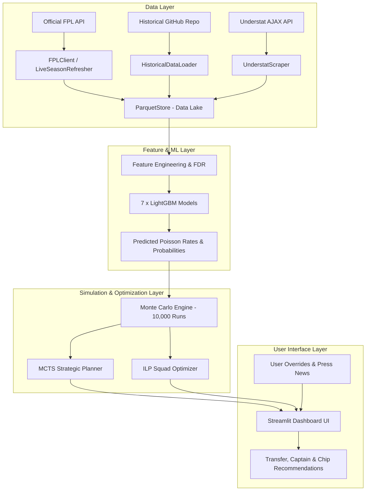

# FPL Engine — Decision Support System

[](https://www.python.org/downloads/)
[](https://github.com/astral-sh/uv)
[](https://streamlit.io/)
[](LICENSE)

**FPL Engine** is an end-to-end Fantasy Premier League (FPL) decision support system. It combines data ingestion pipelines, machine learning expected point predictions (via LightGBM & Poisson rates), Monte Carlo simulations, multi-week strategic optimization (via Monte Carlo Tree Search and Integer Linear Programming), and an interactive Streamlit UI dashboard.

---

## 🌟 Key Features

* **Multi-Source Data Ingestion**: Automated pipelines for the Official FPL API, historical multi-season dataset (`vaastav/Fantasy-Premier-League`), and Understat xG/xA stats.
* **Predictive ML Modeling**: 7 machine learning models trained on historical data:
  * Minutes & Starts prediction (Classifier + Regressor)
  * Expected Goals & Assists ($\lambda_{goals}$, $\lambda_{assists}$ Poisson rate models)
  * Team Clean Sheet probability (Classifier)
  * Yellow card & bonus point probability models
* **Monte Carlo Engine**: Runs 10,000+ matchday simulations per player to derive complete point distributions ($xPts$, Standard Deviation, Floor/Ceiling $P_{10}/P_{90}$, $P_{blank}$, $P_{haul}$).
* **Multi-Gameweek Strategic Planner**: 
  * **Monte Carlo Tree Search (MCTS)** for long-horizon action sequence planning (transfers, chip timing, rolling transfers).
  * **Integer Linear Programming (ILP)** for optimal squad selection within budget and club constraints.
* **Interactive Streamlit Web Dashboard**: 4-page responsive UI featuring interactive squad management, captain comparison, transfer advice, chip strategy, manual match overrides, and model management.

---

## 🏗️ System Architecture



---

## 🚀 Quick Start

### Prerequisites

* **Python 3.12+**
* **`uv`** package manager (recommended)
* **macOS Dependency**: `libomp` installed via Homebrew (required for LightGBM):
  ```bash
  brew install libomp
  ```

### 1. Environment Setup

Clone the repository and set up the virtual environment:

```bash
# Create and activate Python 3.12 virtual environment using uv
uv venv --python 3.12 .venv
source .venv/bin/activate

# Install project dependencies
uv sync --extra dev
```

### 2. Ingest Data

Run the data pipeline to fetch historical datasets (`2023-24`, `2024-25`) and current live season API data (`2025-26` / `2026-27`):

```bash
uv run python scripts/run_pipeline.py
```

To refresh live data for ongoing gameweeks during the season:

```bash
uv run python scripts/refresh.py
```

### 3. Train Predictive Models

Train all 7 machine learning models using historical data:

```bash
uv run python scripts/train_models.py
```

### 4. Launch Streamlit Web App

Start the interactive dashboard:

```bash
uv run streamlit run app/main.py
```

Navigate to `http://localhost:8501` in your browser.

---

## 📱 Web Dashboard Overview

The Streamlit UI is organized into four main pages:

| Page | Description | Key Capabilities |
| :--- | :--- | :--- |
| 🏠 **Dashboard** | Main matchday decision cockpit | Squad $xPts$ overview, 10,000-run Monte Carlo simulations, captain comparison & ceiling/floor risk metrics. |
| 📝 **Manual Inputs** | External context overrides | Set player injury status, return fitness, midweek CL minutes, or upcoming crucial fixtures to fine-tune rotation risk. |
| 📋 **Planning** | Strategic multi-gameweek decision engine | Instant single-GW transfer advice, multi-week MCTS sequence planning, and optimal Chip timing strategies. |
| 🔧 **Model Management** | Model training & data health | Inspect model metrics (AUC, MAE, calibration), trigger re-training, and view raw/processed dataset status. |

---

## 📂 Project Structure

```
fpl_agent/
├── app/                        # Streamlit multi-page frontend application
│   ├── main.py                 # App entrypoint and sidebar navigation
│   └── pages/                  # Page layouts (dashboard, manual inputs, planning, model mgmt)
├── config/                     # System configuration files
├── data/                       # Local data storage (gitignored raw JSON/CSV and processed Parquet)
│   ├── raw/                    # Cached raw API and historical data
│   └── processed/              # Partitioned Parquet data lake (season=YYYY-YY)
├── docs/                       # Comprehensive documentation files
│   ├── data-foundation.md      # Data pipeline & storage architecture
│   ├── frontend-guide.md      # UI implementation & user guide
│   ├── predictive-models.md    # ML model design & training details
│   ├── simulation-engine.md    # Monte Carlo simulation mechanics
│   ├── optimization-layer.md   # MCTS & ILP solver implementation
│   ├── planning-layer.md       # Long-horizon decision planning details
│   ├── agent-layer.md          # Autonomous agent coordination
│   └── user-guide.md           # Step-by-step game guide
├── models/                     # Saved LightGBM model artifacts (.pkl files)
├── scripts/                    # CLI execution scripts
│   ├── run_pipeline.py         # Full data ingestion pipeline
│   ├── refresh.py              # Incremental live-season refresh
│   └── train_models.py         # Model training pipeline
├── src/fpl_engine/             # Core Python package codebase
│   ├── agent/                  # Strategic agent logic & reasoning
│   ├── features/               # Feature engineering & fixture difficulty ratings
│   ├── ingest/                 # API clients & web scrapers (FPL, Understat, Historical)
│   ├── models/                 # LightGBM model definitions & Pydantic domain schemas
│   ├── optimization/           # MCTS & ILP decision optimization solvers
│   ├── planning/               # Multi-gameweek rollouts & transfer logic
│   ├── simulation/             # Monte Carlo simulation engine
│   ├── squad/                  # Squad state manager & persistent storage
│   └── storage/                # Parquet data store abstraction
├── tests/                      # Automated pytest unit & integration tests
├── pyproject.toml              # Project dependencies and build configuration
└── README.md                   # Project README
```

---

## 🧪 Testing

Run the automated test suite with `pytest`:

```bash
uv run --extra dev pytest
```

---

## 📜 License

Distributed under the MIT License. See `LICENSE` for details.
