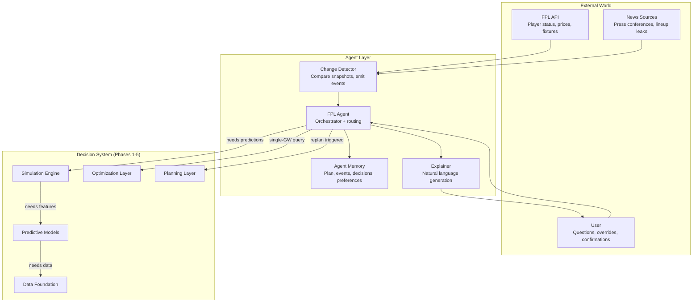
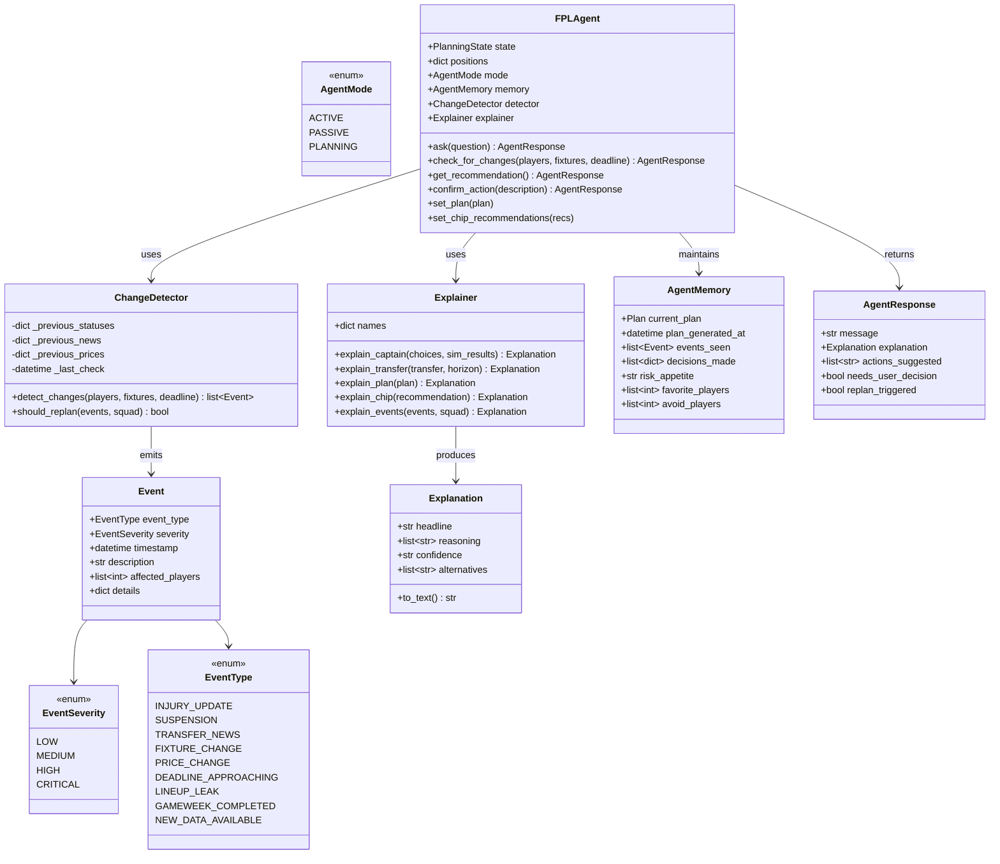
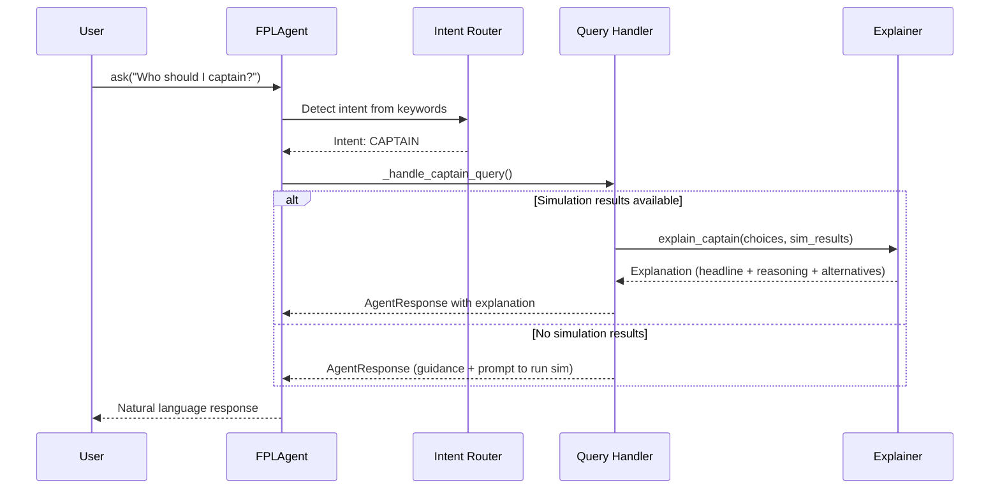
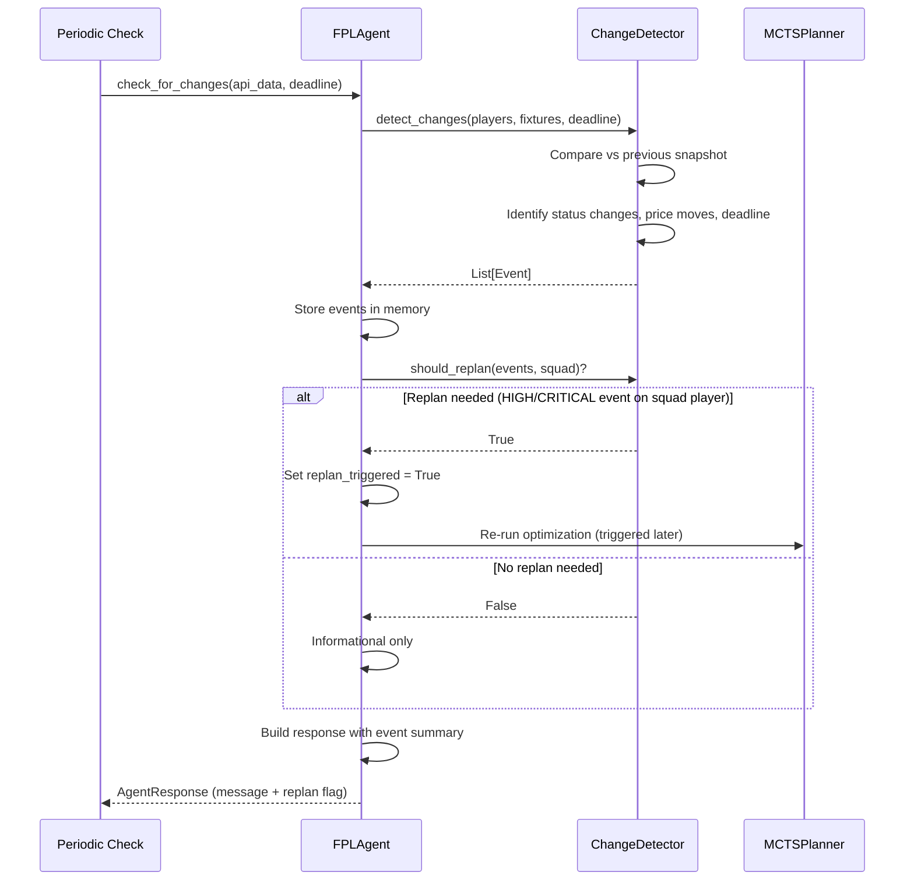
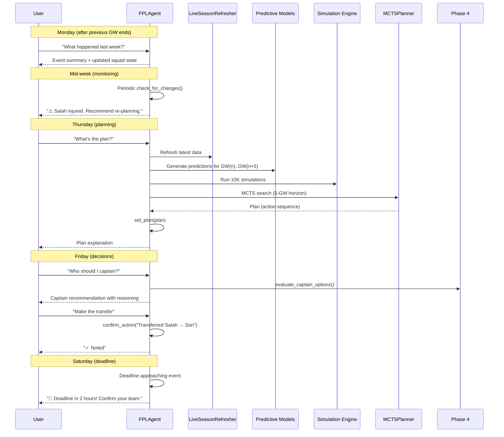
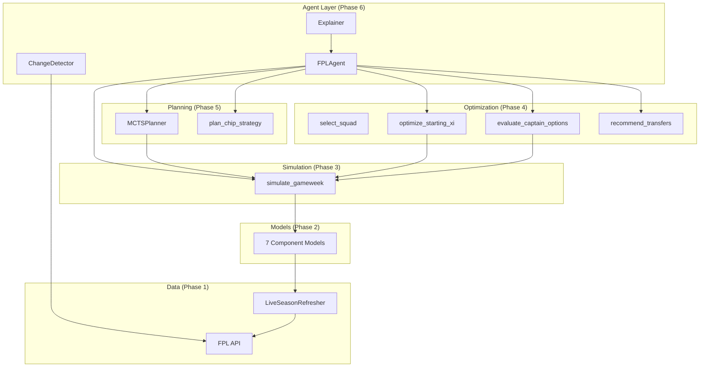

# Phase 6: Agent Layer — Implementation Document

## 1. Overview

The agent layer wraps the entire FPL decision system (data → models → simulation → optimization → planning) in an interactive AI agent. It is the user-facing entry point that:

1. **Senses** — Monitors external data sources for changes (injuries, prices, fixtures)
2. **Thinks** — Determines if re-planning is needed based on event severity
3. **Acts** — Runs optimization and generates recommendations
4. **Explains** — Communicates decisions in natural language with reasoning
5. **Remembers** — Tracks decisions made, events seen, and user preferences

The agent transforms raw model outputs into actionable, explainable advice.

---

## 2. Architecture



---

## 3. Decision Loop

```mermaid
graph LR
    subgraph "Sense"
        S1[Check FPL API for changes]
        S2[Detect injuries, prices, fixtures]
        S3[Emit events with severity]
    end

    subgraph "Think"
        T1[Evaluate event impact on squad]
        T2[Determine if replan needed]
        T3[Run planner if triggered]
    end

    subgraph "Act"
        A1[Generate recommendations]
        A2[Suggest transfers/captain/chips]
        A3[Wait for user confirmation]
    end

    subgraph "Explain"
        E1[Translate numbers to reasoning]
        E2[Compare alternatives]
        E3[State confidence level]
    end

    S1 --> S2 --> S3 --> T1 --> T2 --> T3 --> A1 --> A2 --> A3 --> E1 --> E2 --> E3
```



---

## 4. Class Diagram



---

## 5. Sequence Diagrams

### 5.1 User Asks a Question



### 5.2 Change Detection and Re-planning



### 5.3 Full Weekly Workflow



---

## 6. Change Detection System

### 6.1 Event Types and Severity

| Event Type | Severity | Trigger | Example |
|-----------|----------|---------|---------|
| Injury: available → injured | HIGH | Status field changes | "Salah: status a→i. Hamstring" |
| Injury: available → doubtful (≤25%) | HIGH | Status + chance | "Saka: doubtful, 25% chance" |
| Injury: available → doubtful (>25%) | MEDIUM | Status + chance | "Palmer: minor knock, 75% chance" |
| Injury: injured → available | MEDIUM | Status field changes | "Kane: back to full training" |
| News update (injury-related) | MEDIUM | News text changes | "Expected back GW15" |
| Price rise/fall | LOW | Price field changes | "Haaland: £14.5m → £14.6m" |
| Deadline ≤ 2 hours | CRITICAL | Time comparison | "Deadline in 1.5 hours!" |
| Deadline ≤ 12 hours | HIGH | Time comparison | "Deadline in 8 hours" |
| Deadline ≤ 24 hours | MEDIUM | Time comparison | "Deadline tomorrow" |

### 6.2 Re-planning Trigger Logic

```
should_replan = TRUE if:
    - Any HIGH or CRITICAL event affects a player in the current squad
    - OR 3+ MEDIUM events affect squad players

should_replan = FALSE if:
    - Only LOW events
    - HIGH/CRITICAL events only affect non-squad players
    - Only 1-2 MEDIUM events on squad players
```

---

## 7. Natural Language Explainer

### 7.1 Explanation Types

| Method | Input | Output |
|--------|-------|--------|
| `explain_captain()` | Captain choices + sim results | "Captain Haaland: highest E[2×pts] = 15.6, 28% haul chance" |
| `explain_transfer()` | Transfer option | "Sell Salah → Buy Son: +3.2 xPts gain, free transfer" |
| `explain_plan()` | Multi-GW plan | "GW12: Roll. GW13: Transfer Palmer→Saka. GW14: Bench Boost" |
| `explain_chip()` | Chip recommendation | "Triple Captain GW18: +9.9 pts (Haaland at home vs Burnley)" |
| `explain_events()` | Event list + squad | "⚠️ 2 events affecting your squad: Salah injured, deadline 6h" |

### 7.2 Explanation Structure

Every explanation contains:

| Field | Purpose | Example |
|-------|---------|---------|
| `headline` | One-line summary | "Captain Haaland" |
| `reasoning` | Bullet points of logic | ["Highest E[2×pts]: 15.6", "28% haul chance", "Low blank risk: 12%"] |
| `confidence` | How sure the agent is | "high" / "medium" / "low" |
| `alternatives` | What else was considered | ["Salah: 12.8 pts (2.8 behind)", "Palmer has higher ceiling"] |

---

## 8. Agent Memory

The agent maintains state across interactions:

| Field | Type | Purpose |
|-------|------|---------|
| `current_plan` | `Plan` | Most recent MCTS plan |
| `plan_generated_at` | `datetime` | When the plan was computed (staleness detection) |
| `events_seen` | `list[Event]` | All detected events (for "what happened?" queries) |
| `decisions_made` | `list[dict]` | User-confirmed actions (audit trail) |
| `risk_appetite` | `str` | "aggressive"/"balanced"/"conservative" — affects captain/differential advice |
| `favorite_players` | `list[int]` | Players the user prefers (soft constraint) |
| `avoid_players` | `list[int]` | Players the user wants to avoid |

---

## 9. Conversational Routing

The agent routes user queries by keyword matching:

| Keywords | Intent | Handler |
|----------|--------|---------|
| captain, cap, armband | CAPTAIN | `_handle_captain_query()` |
| transfer, buy, sell, replace | TRANSFER | `_handle_transfer_query()` |
| starting, lineup, start, bench | LINEUP | `_handle_lineup_query()` |
| chip, wildcard, free hit, bench boost, triple | CHIP | `_handle_chip_query()` |
| plan, ahead, next few, strategy | PLAN | `_handle_plan_query()` |
| news, injury, update, changes | NEWS | `_handle_news_query()` |
| squad, team, my players | SQUAD | `_handle_squad_query()` |
| (unrecognized) | HELP | Show available commands |

---

## 10. Validation Results

### Conversational Queries

| Query | Response type | Correct? |
|-------|--------------|----------|
| "Who should I captain?" | Captain guidance + prompt for sim data | ✅ |
| "Should I make a transfer?" | Shows FT count + plan recommendation | ✅ |
| "When should I play my chips?" | Lists available chips + recommendations | ✅ |
| "Show my team" | Squad by position + bank + FTs | ✅ |
| (unrecognized) | Help menu with available topics | ✅ |

### Change Detection

| Scenario | Events emitted | Severity | Replan? |
|----------|---------------|----------|---------|
| Salah: status a→i | INJURY_UPDATE | HIGH | ✅ Yes (squad player) |
| Deadline in 6 hours | DEADLINE_APPROACHING | HIGH | ✅ Yes |
| Non-squad player price rise | PRICE_CHANGE | LOW | ❌ No |
| 3 medium events on squad | Multiple INJURY_UPDATE | MEDIUM ×3 | ✅ Yes |

### Event Explanation Output

```
**2 changes detected**

• ⚠️ 1 event(s) affecting YOUR squad:
•   • [high] Salah: status a→i. Hamstring - expected back GW15
•
1 significant event(s) elsewhere:
•   • Deadline in 6 hours.
•
🔄 Recommendation: Re-run optimization with updated data

Confidence: critical
```

---

## 11. Integration with Other Phases



---

## 12. Assumptions and Future Enhancements

### Current Limitations

| Limitation | Impact | Future enhancement |
|-----------|--------|-------------------|
| Keyword-based intent routing | May misinterpret complex queries | Replace with LLM-based intent classification |
| No real-time monitoring loop | User must trigger check_for_changes() | Add scheduled background polling |
| Explainer uses templates | Explanations can feel formulaic | Integrate LLM for dynamic natural language |
| No learning from outcomes | Doesn't improve based on past accuracy | Add outcome tracking + model retraining triggers |
| Single-user, no league context | Doesn't consider mini-league rivals | Add EO-aware and rival-tracking strategy |

### Planned Enhancements

1. **LLM integration** — Use language model for richer explanations and query understanding
2. **Background monitoring** — Continuous API polling with push notifications
3. **Outcome learning** — Track prediction accuracy and adjust confidence
4. **Mini-league awareness** — Consider rivals' squads for differential strategy
5. **Voice interface** — Natural language input/output for mobile use

---

## 13. File Structure

```
src/fpl_engine/agent/
├── __init__.py
├── events.py         ← EventType, EventSeverity, Event, ChangeDetector
├── explainer.py      ← Explanation, Explainer (natural language generation)
└── agent.py          ← FPLAgent, AgentMemory, AgentResponse, AgentMode
```

---

## 14. Usage Examples

### Basic interaction

```python
from fpl_engine.agent.agent import FPLAgent
from fpl_engine.planning.state import PlanningState, Chip

state = PlanningState(
    squad=my_squad_ids,
    bank=5,
    free_transfers=1,
    chips_available={Chip.BENCH_BOOST, Chip.TRIPLE_CAPTAIN},
    current_gw=12,
)

agent = FPLAgent(state=state, player_names=names, positions=positions)

# Ask questions
response = agent.ask("Who should I captain this week?")
print(response.message)

response = agent.ask("Show my team")
print(response.message)
```

### Monitoring for changes

```python
# Fetch latest data from FPL API
async with FPLClient() as client:
    bootstrap = await client.get_bootstrap()

# Check for changes
from datetime import datetime, timedelta
deadline = datetime(2026, 9, 14, 11, 0)  # GW4 deadline

response = agent.check_for_changes(
    current_players=bootstrap["elements"],
    deadline=deadline,
)
print(response.message)

if response.replan_triggered:
    # Re-run the planner
    plan = planner.search(agent.state, horizon=5, iterations=2000)
    agent.set_plan(plan)
```

### Full workflow

```python
# 1. Monitor
response = agent.check_for_changes(api_data, deadline=deadline)

# 2. Plan (if needed)
if response.replan_triggered:
    plan = planner.search(agent.state, horizon=5)
    agent.set_plan(plan)
    chip_recs = plan_chip_strategy(agent.state, xpts_provider, positions)
    agent.set_chip_recommendations(chip_recs)

# 3. Get advice
response = agent.ask("What's the plan for the next few weeks?")
print(response.message)

# 4. Execute
response = agent.ask("Should I make a transfer?")
print(response.message)

# 5. Confirm
agent.confirm_action("Transferred Salah → Son, captained Haaland")
```
