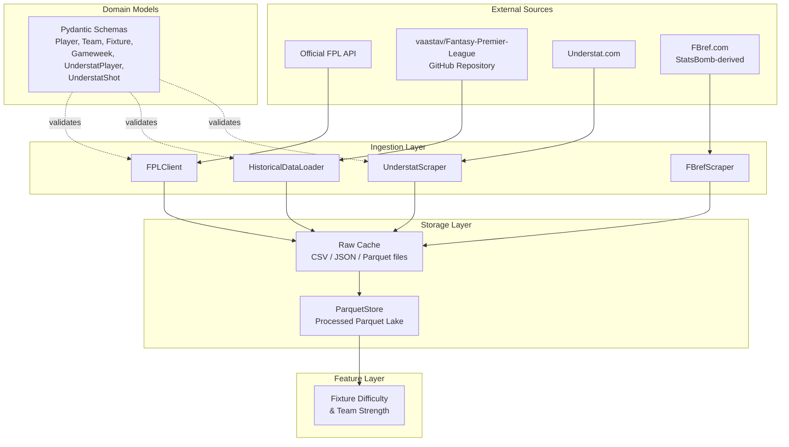
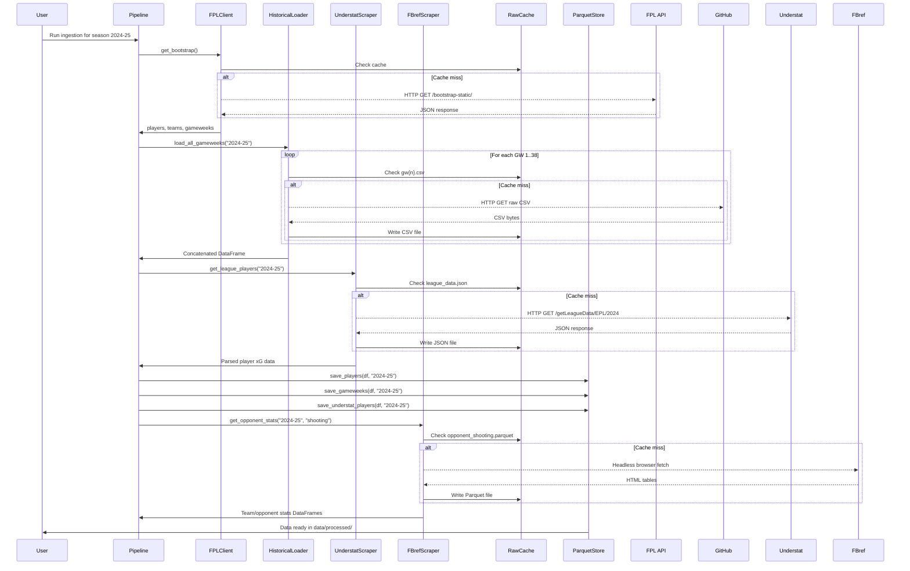
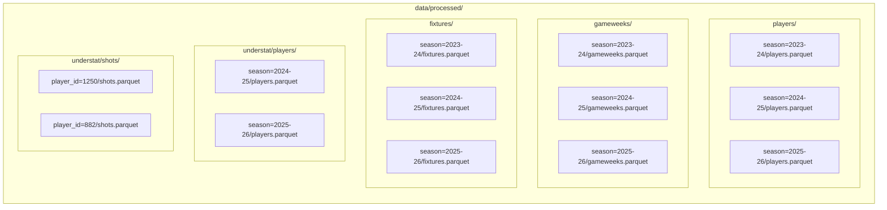
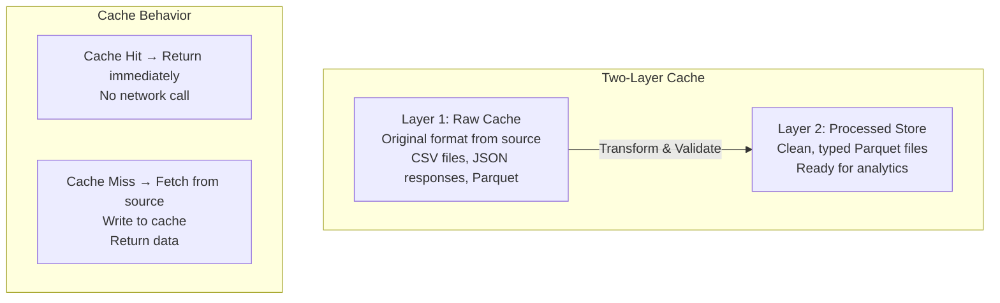
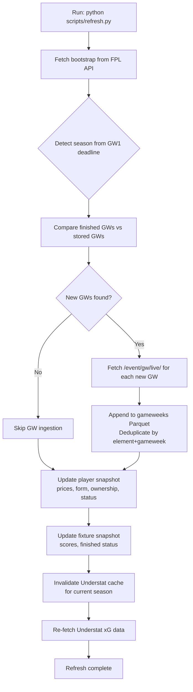
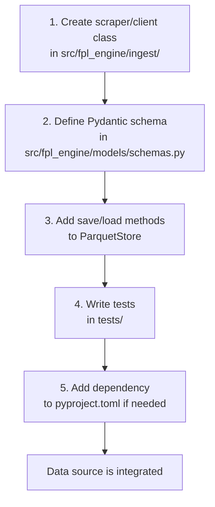
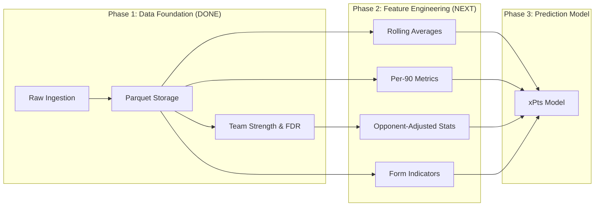

# Data Foundation Phase — Implementation Document

## 1. Overview

The Data Foundation phase is the bedrock of the entire FPL decision system. Its responsibility is to reliably ingest, validate, cache, and store structured data from multiple external sources so that all downstream components (feature engineering, prediction models, optimizers, planning agents) operate on clean, consistent, queryable data.

No predictions, no optimizations, no recommendations happen without this layer functioning correctly.

---

## 2. High-Level Architecture



---

## 3. Data Flow



---

## 4. Directory Structure

```
fpl/
├── pyproject.toml
├── .gitignore
├── scripts/
│   ├── run_pipeline.py            ← Full ingestion pipeline runner
│   └── refresh.py                 ← Live season incremental refresh
├── src/fpl_engine/
│   ├── __init__.py
│   ├── ingest/
│   │   ├── __init__.py
│   │   ├── fpl_api.py            ← Live FPL API client
│   │   ├── historical.py         ← Historical data from GitHub
│   │   ├── understat.py          ← Understat xG scraper
│   │   ├── fbref.py              ← FBref advanced stats (via soccerdata)
│   │   └── live_refresh.py       ← Incremental current-season refresh
│   ├── models/
│   │   ├── __init__.py
│   │   └── schemas.py            ← Pydantic domain models
│   ├── storage/
│   │   ├── __init__.py
│   │   └── parquet_store.py      ← Parquet data lake
│   └── features/
│       ├── __init__.py
│       └── fixture_difficulty.py  ← Team strength & FDR
├── tests/
│   ├── __init__.py
│   └── test_ingestion.py         ← 21 passing tests (ingestion + live refresh)
├── docs/
│   └── data-foundation.md        ← This document
└── data/                          ← Created at runtime, gitignored
    ├── raw/
    │   ├── historical/            ← Cached CSVs from GitHub
    │   ├── understat/             ← Cached JSON from Understat AJAX API
    │   └── fbref/                 ← Cached Parquet from FBref (via soccerdata)
    │       └── processed/
    │           └── 2025-26/
    │               ├── team_shooting.parquet
    │               ├── team_keeper.parquet
    │               ├── opponent_shooting.parquet
    │               ├── opponent_standard.parquet
    │               └── player_standard.parquet
    └── processed/                 ← Clean Parquet files
        ├── players/season=2023-24/
        ├── gameweeks/season=2023-24/
        ├── fixtures/season=2023-24/
        ├── teams/season=2023-24/
        └── understat/players/season=2024-25/
```

---

## 5. Data Sources

### 5.1 Official FPL API

| Property | Value |
|----------|-------|
| Base URL | `https://fantasy.premierleague.com/api` |
| Auth Required | No |
| Rate Limiting | Undocumented, but aggressive fetching is throttled |
| Data Format | JSON |
| Availability | Live during active season (August–May) |

**What it provides:**

- All registered players with current season stats (goals, assists, points, xG, xA, form, ownership, price, status)
- All 20 teams with strength ratings (home/away, attack/defence)
- All 38 gameweeks with deadlines, averages, most-captained
- All 380 fixtures with scores, difficulty ratings, kickoff times
- Per-player detailed history (every GW performance this season)
- Per-player upcoming fixtures with difficulty
- Live in-progress gameweek data (bonus points, stats as they happen)

**Limitations:**

- Only current season data (no historical access)
- xG/xA only available from 2023-24 season onwards
- No shot-level data
- No underlying event-level data (individual shots, passes, tackles)

### 5.2 vaastav/Fantasy-Premier-League (GitHub)

| Property | Value |
|----------|-------|
| URL | `https://github.com/vaastav/Fantasy-Premier-League` |
| Auth Required | No |
| Format | CSV files served via GitHub raw URLs |
| Coverage | 2016-17 through 2025-26 |

**What it provides:**

- Cleaned player summaries per season
- Per-gameweek player performance data (the same as GW data from the API, but historical)
- Fixture results
- Team metadata
- Individual player history files

**Why it matters:**

This is the only freely available source of historical FPL data going back multiple seasons. Training a prediction model requires at least 3-5 seasons of data to learn patterns like fixture effects, positional differences, and seasonal trends.

### 5.3 Understat

| Property | Value |
|----------|-------|
| URL | `https://understat.com` |
| Auth Required | No |
| Format | JSON via AJAX endpoints (e.g., `/getLeagueData/EPL/{year}`) |
| Coverage | 2014-15 onwards for EPL |

**What it provides:**

- Player season summaries: xG, xA, npxG (non-penalty xG), xGChain, xGBuildup
- Match-by-match xG/xA for every player
- Individual shot-level data: pitch coordinates (x, y), xG per shot, result, situation (open play, set piece, penalty)
- Team-level xG/xGA aggregates
- Match rosters and lineups

**Why it matters:**

The FPL API only provides cumulative xG. Understat gives granular shot-level data which enables:
- Per-90 xG calculations (minutes-adjusted)
- Shot quality analysis (are they taking good chances or lucky ones?)
- Situation breakdowns (open play vs set pieces)
- Overperformance detection (actual goals vs xG → regression candidates)

---

### 5.4 FBref (StatsBomb-derived)

| Property | Value |
|----------|-------|
| URL | `https://fbref.com` |
| Auth Required | No |
| Format | HTML tables, accessed via `soccerdata` library (headless browser) |
| Coverage | 2017-18 onwards for EPL |

**What it provides:**

- Team shooting stats: goals, shots, shots on target, shot accuracy, goals/shot, PKs
- Opponent shooting stats (critical): what each team **concedes** — shots allowed/90, goals conceded, save rate against
- GK stats: saves, save%, goals against/90, clean sheet%, penalty saves
- Player stats: per-90 rates for goals, assists, xG, xA, minutes, starts
- Misc: cards, fouls won, aerials won/lost

**Why it matters (vs what we already have):**

| Signal | Understat | FBref (new) |
|--------|-----------|-------------|
| Team xGA | ✅ Season avg | ✅ Per-90, more granular |
| Shots conceded | ❌ | ✅ `Standard_Sh/90`, `Standard_SoT` |
| GK save % | Derived manually | ✅ `Performance_Save%` directly |
| Shots on target allowed | ❌ | ✅ `Standard_SoT` (opponent) |
| CS% per team | ❌ | ✅ `Performance_CS%` |
| PK data (team level) | ❌ | ✅ `Penalty Kicks_PKatt`, `PKsv` |

**Access method:** FBref is behind Cloudflare protection. The `soccerdata` library handles bypass via a headless Chrome browser. Rate limiting is ~20 requests/minute.

**Dependency:** `soccerdata` (installed with `pip install soccerdata`)

---

## 6. Classes and Interfaces

### 6.1 Ingestion Layer

#### `FPLClient`

Location: `src/fpl_engine/ingest/fpl_api.py`

An async HTTP client for the official Fantasy Premier League API. Must be used as an async context manager to properly manage connection lifecycle.

**Properties:**

| Property | Type | Description |
|----------|------|-------------|
| `_timeout` | `float` | HTTP request timeout in seconds (default: 30.0) |
| `_client` | `httpx.AsyncClient | None` | Internal HTTP client, managed by context manager |

**Methods:**

| Method | Returns | Description |
|--------|---------|-------------|
| `get_bootstrap()` | `dict[str, Any]` | Fetch the master dataset containing all players, teams, gameweeks, and game settings |
| `get_players()` | `list[dict]` | Extract all player records from bootstrap |
| `get_teams()` | `list[dict]` | Extract all team records from bootstrap |
| `get_gameweeks()` | `list[dict]` | Extract all gameweek (event) records from bootstrap |
| `get_fixtures(gameweek=None)` | `list[dict]` | All fixtures, optionally filtered to a specific gameweek |
| `get_player_summary(player_id)` | `dict` | Detailed player history + upcoming fixtures |
| `get_player_history(player_id)` | `list[dict]` | Past GW performances for a player this season |
| `get_player_upcoming(player_id)` | `list[dict]` | Upcoming fixtures with difficulty for a player |
| `get_live_gameweek(gameweek)` | `dict` | Live in-progress data for a gameweek |
| `get_current_gameweek()` | `int | None` | Current gameweek number, or None if season hasn't started |

**Resilience:** All HTTP calls use exponential backoff retry (3 attempts, 1-10s wait).

---

#### `HistoricalDataLoader`

Location: `src/fpl_engine/ingest/historical.py`

Loads historical FPL data from the vaastav/Fantasy-Premier-League GitHub repository. Downloads CSV files on first access, then serves from local file cache on subsequent calls.

**Properties:**

| Property | Type | Description |
|----------|------|-------------|
| `cache_dir` | `Path` | Local directory for cached CSV files (default: `data/raw/historical`) |

**Methods:**

| Method | Returns | Description |
|--------|---------|-------------|
| `load_players(season)` | `DataFrame` | Cleaned player summary for a season (element, name, team, position, total_points, etc.) |
| `load_fixtures(season)` | `DataFrame` | All fixtures with results for a season |
| `load_teams(season)` | `DataFrame` | Team metadata for a season |
| `load_gameweek(season, gw)` | `DataFrame` | All player performances for a specific gameweek |
| `load_all_gameweeks(season, max_gw=38)` | `DataFrame` | Concatenated data for all gameweeks in a season, with `gameweek` column added |
| `load_multi_season_gameweeks(seasons=None, max_gw=38)` | `DataFrame` | Cross-season concatenation with `season` column added; defaults to all available seasons (2016-17 through 2025-26) |

**Resilience:** HTTP fetches use exponential backoff retry. 404 errors during gameweek loading are handled gracefully (indicates season is incomplete).

---

#### `UnderstatScraper`

Location: `src/fpl_engine/ingest/understat.py`

Fetches xG data from Understat via their AJAX JSON API. The site exposes endpoints like `/getLeagueData/{league}/{season}` and `/getPlayerData/{player_id}` that return structured JSON directly — no HTML parsing or headless browser needed.

**Properties:**

| Property | Type | Description |
|----------|------|-------------|
| `cache_dir` | `Path` | Local directory for cached JSON responses (default: `data/raw/understat`) |

**Methods:**

| Method | Returns | Description |
|--------|---------|-------------|
| `get_league_data(season)` | `dict` | Full league data (teams, players, dates) via AJAX endpoint |
| `get_league_players(season)` | `list[dict]` | All EPL player season summaries (id, name, team, games, minutes, goals, assists, xG, xA, npxG, xGChain, xGBuildup, shots, key_passes) |
| `get_league_teams(season)` | `dict` | Team-level xG/xGA stats with match history for a season |
| `get_player_data(player_id)` | `dict` | Full player data (matches, shots, groups) via AJAX endpoint |
| `get_player_matches(player_id)` | `list[dict]` | Match-by-match xG/xA for a player across all their seasons |
| `get_player_shots(player_id)` | `list[dict]` | Every shot taken by a player with x/y coordinates, xG, result, situation |
| `get_player_grouped_stats(player_id)` | `dict` | Stats grouped by season, situation, shot zone, etc. |
| `get_match_shots(match_id)` | `dict` | All shots in a match, split by home ('h') and away ('a') |
| `get_match_rosters(match_id)` | `dict` | Starting lineups and substitutes for a match |
| `get_all_player_ids(season)` | `list[int]` | All Understat player IDs for EPL in a given season |
| `clear_cache()` | `None` | Remove all cached JSON files |

**Resilience:** Exponential backoff retry (3 attempts, 2-15s wait). Browser-like User-Agent header and `X-Requested-With: XMLHttpRequest` header for AJAX requests.

**Internal helpers (module-level functions):**

| Function | Description |
|----------|-------------|
| `_decode_understat_json(encoded)` | Decodes Understat's hex-escaped (`\xHH`) JSON strings back into Python objects (legacy fallback) |
| `_extract_json_var(html, var_name)` | Extracts a named JavaScript variable's JSON value from an HTML page using regex (legacy fallback) |

---

#### `FBrefScraper`

Location: `src/fpl_engine/ingest/fbref.py`

Fetches advanced stats from FBref using the `soccerdata` library for Cloudflare bypass. Provides team-level and player-level stats with local parquet caching.

**Properties:**

| Property | Type | Description |
|----------|------|-------------|
| `cache_dir` | `Path` | Local directory for cached parquet files (default: `data/raw/fbref`) |

**Methods:**

| Method | Returns | Description |
|--------|---------|-------------|
| `get_team_stats(season, stat_type)` | `DataFrame` | Team stats for a season. Types: standard, shooting, keeper, playing_time, misc |
| `get_opponent_stats(season, stat_type)` | `DataFrame` | What teams concede — shots/goals/SoT allowed. Types: standard, shooting |
| `get_player_stats(season, stat_type)` | `DataFrame` | Per-player stats (551 players for EPL) |
| `get_gk_stats(season)` | `DataFrame` | GK-specific stats (saves, save%, CS%, PKsv) |
| `fetch_all_team_stats(season)` | `dict[str, DataFrame]` | All team + opponent stat types in one call |
| `fetch_all_player_stats(season)` | `dict[str, DataFrame]` | All player stat types in one call |
| `clear_cache(season=None)` | `None` | Remove cached parquet files |

**Key data available (opponent shooting — most critical for models):**

| Column | Description |
|--------|-------------|
| `Standard_Sh/90` | Shots allowed per 90 minutes (lower = better defence) |
| `Standard_SoT` | Shots on target conceded (season total) |
| `Standard_Gls` | Goals conceded (season total) |
| `Standard_G/SoT` | Opponent conversion rate (goals per shot on target) |
| `Standard_PKatt` | Penalties conceded |

---

#### `LiveSeasonRefresher`

Location: `src/fpl_engine/ingest/live_refresh.py`

Handles incremental ingestion of the current season's data. Unlike historical loading (which pulls a full season at once from GitHub), this component detects which gameweeks have completed since the last refresh, fetches only the new data, and appends it to the existing store.

Designed to run after each gameweek completes (~weekly during the active season).

**Properties:**

| Property | Type | Description |
|----------|------|-------------|
| `store` | `ParquetStore` | Storage layer to read/write data |
| `understat_cache_dir` | `str` | Path to Understat cache (for invalidation) |
| `_season` | `str | None` | Season override; auto-detected from API if None |

**Methods:**

| Method | Returns | Description |
|--------|---------|-------------|
| `refresh(force_understat=False)` | `RefreshResult` | Run a full incremental refresh: detect new GWs, fetch data, update snapshots, refresh Understat |

**Internal workflow of `refresh()`:**

1. Fetch bootstrap from FPL API → get current state of all players, teams, GWs
2. Auto-detect season from GW1 deadline date
3. Compare finished GWs (from API) vs stored GWs (from Parquet) → identify new ones
4. For each new GW: fetch live data via `/event/{gw}/live/` endpoint
5. Append new rows to gameweeks Parquet (with deduplication)
6. Overwrite player + team + fixture snapshots with latest API state
7. Invalidate Understat cache for the current season and re-fetch xG data

**`RefreshResult` dataclass:**

| Field | Type | Description |
|-------|------|-------------|
| `season` | `str` | Detected or specified season |
| `timestamp` | `datetime` | When the refresh ran |
| `new_gameweeks` | `list[int]` | GW numbers that were newly ingested |
| `total_new_rows` | `int` | Number of new player-GW rows added |
| `players_updated` | `int` | Total players in the snapshot |
| `fixtures_updated` | `int` | Total fixtures in the snapshot |
| `understat_refreshed` | `bool` | Whether Understat xG data was refreshed |
| `errors` | `list[str]` | Any non-fatal errors encountered |
| `has_new_data` | `bool` (property) | Whether any new GWs were ingested |

---

### 6.2 Domain Models

Location: `src/fpl_engine/models/schemas.py`

All domain entities are defined as Pydantic `BaseModel` subclasses. They serve as validation contracts — any data flowing into the system can be validated against these schemas before storage.

#### `Position` (IntEnum)

Maps FPL position codes to human-readable names.

| Value | Name |
|-------|------|
| 1 | GKP (Goalkeeper) |
| 2 | DEF (Defender) |
| 3 | MID (Midfielder) |
| 4 | FWD (Forward) |

#### `Team`

A Premier League team with FPL strength ratings.

| Field | Type | Description |
|-------|------|-------------|
| `id` | `int` | FPL team ID (1-20) |
| `name` | `str` | Full team name |
| `short_name` | `str` | 3-letter abbreviation |
| `strength` | `int` | Overall strength (1-5) |
| `strength_overall_home` | `int` | Overall home strength |
| `strength_overall_away` | `int` | Overall away strength |
| `strength_attack_home` | `int` | Home attacking strength |
| `strength_attack_away` | `int` | Away attacking strength |
| `strength_defence_home` | `int` | Home defensive strength |
| `strength_defence_away` | `int` | Away defensive strength |

#### `Player`

A player's current-season summary as returned by the FPL API bootstrap.

| Field | Type | Description |
|-------|------|-------------|
| `id` | `int` | Unique FPL player ID |
| `web_name` | `str` | Display name (e.g., "Salah") |
| `first_name` | `str` | First name |
| `second_name` | `str` | Surname |
| `team` | `int` | Team ID |
| `element_type` | `int` | Position (1=GKP, 2=DEF, 3=MID, 4=FWD) |
| `now_cost` | `int` | Current price × 10 (e.g., 130 = £13.0m) |
| `total_points` | `int` | Season total FPL points |
| `points_per_game` | `float` | Average points per appearance |
| `minutes` | `int` | Total minutes played |
| `goals_scored` | `int` | Goals |
| `assists` | `int` | Assists |
| `clean_sheets` | `int` | Clean sheets |
| `saves` | `int` | Saves (GKPs) |
| `bonus` | `int` | Bonus points awarded |
| `bps` | `int` | Bonus Points System score |
| `form` | `float` | Recent form (avg points over last 30 days) |
| `selected_by_percent` | `float` | Ownership percentage |
| `transfers_in_event` | `int` | Transfers in this GW |
| `transfers_out_event` | `int` | Transfers out this GW |
| `expected_goals` | `float` | Season xG (default 0.0, available 2023-24+) |
| `expected_assists` | `float` | Season xA |
| `expected_goal_involvements` | `float` | Season xGI |
| `expected_goals_conceded` | `float` | Season xGC |
| `status` | `str` | Availability: a=available, d=doubtful, i=injured, s=suspended, u=unavailable |
| `chance_of_playing_next_round` | `int | None` | Percentage chance of playing (None if unknown) |
| `news` | `str` | Injury/status news text |

#### `Fixture`

A single Premier League match.

| Field | Type | Description |
|-------|------|-------------|
| `id` | `int` | Fixture ID |
| `event` | `int | None` | Gameweek number (None if not yet scheduled) |
| `team_h` | `int` | Home team ID |
| `team_a` | `int` | Away team ID |
| `team_h_difficulty` | `int` | FDR for home team (1-5) |
| `team_a_difficulty` | `int` | FDR for away team (1-5) |
| `team_h_score` | `int | None` | Home goals (None if not played) |
| `team_a_score` | `int | None` | Away goals (None if not played) |
| `started` | `bool` | Whether the match has kicked off |
| `finished` | `bool` | Whether the match is complete |
| `kickoff_time` | `datetime | None` | Scheduled kickoff |

#### `GameweekHistory`

A single player's full statistical record for one gameweek. This is the most granular official data point.

| Field | Type | Description |
|-------|------|-------------|
| `element` | `int` | Player ID |
| `fixture` | `int` | Fixture ID |
| `round` | `int` | Gameweek number |
| `opponent_team` | `int` | Opponent team ID |
| `was_home` | `bool` | Whether the player was at home |
| `total_points` | `int` | FPL points earned |
| `minutes` | `int` | Minutes played (0, 1-59, 60+) |
| `goals_scored` | `int` | Goals |
| `assists` | `int` | Assists |
| `clean_sheets` | `int` | Clean sheet (1 or 0) |
| `goals_conceded` | `int` | Goals conceded |
| `saves` | `int` | Saves |
| `bonus` | `int` | Bonus points |
| `bps` | `int` | BPS score |
| `yellow_cards` | `int` | Yellow cards |
| `red_cards` | `int` | Red cards |
| `penalties_saved` | `int` | Penalties saved |
| `penalties_missed` | `int` | Penalties missed |
| `own_goals` | `int` | Own goals |
| `expected_goals` | `float` | GW xG |
| `expected_assists` | `float` | GW xA |
| `expected_goal_involvements` | `float` | GW xGI |
| `expected_goals_conceded` | `float` | GW xGC |
| `value` | `int` | Player price at the time × 10 |
| `selected` | `int` | Number of managers who owned the player |
| `transfers_in` | `int` | Transfers in that GW |
| `transfers_out` | `int` | Transfers out that GW |

#### `Gameweek`

Metadata about a gameweek round.

| Field | Type | Description |
|-------|------|-------------|
| `id` | `int` | Gameweek number (1-38) |
| `name` | `str` | Display name (e.g., "Gameweek 1") |
| `deadline_time` | `datetime` | Transfer deadline |
| `is_current` | `bool` | Whether this is the active GW |
| `is_next` | `bool` | Whether this is the next upcoming GW |
| `finished` | `bool` | Whether all matches are complete |
| `highest_score` | `int | None` | Highest manager score |
| `average_score` | `int | None` | Average manager score |
| `most_captained` | `int | None` | Player ID most captained |
| `most_vice_captained` | `int | None` | Player ID most vice-captained |

#### `UnderstatPlayer`

Season-level xG summary from Understat.

| Field | Type | Description |
|-------|------|-------------|
| `player_name` | `str` | Player name as it appears on Understat |
| `team` | `str` | Team name |
| `games` | `int` | Matches played |
| `minutes` | `int` | Minutes played |
| `goals` | `int` | Actual goals |
| `assists` | `int` | Actual assists |
| `xg` | `float` | Expected Goals |
| `xa` | `float` | Expected Assists |
| `npxg` | `float` | Non-Penalty Expected Goals |
| `xg_chain` | `float` | xG Chain (involved in possessions leading to shots) |
| `xg_buildup` | `float` | xG Buildup (involved in possessions, excluding shot and assist) |
| `shots` | `int` | Total shots |
| `key_passes` | `int` | Key passes (passes leading to shots) |

#### `UnderstatShot`

A single shot event with spatial and contextual data.

| Field | Type | Description |
|-------|------|-------------|
| `id` | `int` | Shot ID |
| `minute` | `int` | Minute of the match |
| `x` | `float` | Pitch x-coordinate (0-1, left to right) |
| `y` | `float` | Pitch y-coordinate (0-1, top to bottom) |
| `xg` | `float` | Expected Goal probability for this shot |
| `player` | `str` | Shooter name |
| `team` | `str` | Team name |
| `result` | `str` | Outcome: Goal, SavedShot, MissedShots, BlockedShot, ShotOnPost |
| `situation` | `str` | Context: OpenPlay, FromCorner, SetPiece, DirectFreekick, Penalty |
| `season` | `str` | Season year |
| `match_id` | `int` | Understat match ID |
| `player_id` | `int` | Understat player ID |

#### `SeasonMetadata`

Metadata for tracking which season is active.

| Field | Type | Description |
|-------|------|-------------|
| `season` | `str` | Season string (e.g., "2024-25") |
| `start_year` | `int` | Starting year |
| `total_gameweeks` | `int` | Total GWs (default 38) |
| `current_gameweek` | `int | None` | Current active GW |
| `is_active` | `bool` | Whether this season is currently running |

---

### 6.3 Storage Layer

#### `ParquetStore`

Location: `src/fpl_engine/storage/parquet_store.py`

A Parquet-based data lake that organizes processed data into a Hive-style partitioned directory structure. Partitioning is by season (for time-series data) or by player ID (for entity-specific data like shots).

**Properties:**

| Property | Type | Description |
|----------|------|-------------|
| `base_dir` | `Path` | Root directory for the processed data lake (default: `data/processed`) |

**Write Methods:**

| Method | Parameters | Description |
|--------|------------|-------------|
| `save_players(df, season)` | DataFrame, season string | Save player summary for a season |
| `save_gameweeks(df, season)` | DataFrame, season string | Save per-GW player performance data |
| `save_fixtures(df, season)` | DataFrame, season string | Save fixture data |
| `save_teams(df, season)` | DataFrame, season string | Save team metadata |
| `save_understat_players(df, season)` | DataFrame, season string | Save Understat xG summaries |
| `save_understat_shots(df, player_id)` | DataFrame, player ID | Save shot-level data for one player |
| `save_understat_matches(df, player_id)` | DataFrame, player ID | Save match-by-match data for one player |

**Read Methods:**

| Method | Parameters | Returns | Description |
|--------|------------|---------|-------------|
| `load_players(season)` | season string | DataFrame | Load player summary |
| `load_gameweeks(season)` | season string | DataFrame | Load GW data |
| `load_fixtures(season)` | season string | DataFrame | Load fixtures |
| `load_teams(season)` | season string | DataFrame | Load teams |
| `load_understat_players(season)` | season string | DataFrame | Load Understat summaries |
| `load_understat_shots(player_id)` | player ID | DataFrame | Load shots for a player |
| `load_understat_matches(player_id)` | player ID | DataFrame | Load matches for a player |
| `load_all_gameweeks(seasons=None)` | optional season list | DataFrame | Load and concatenate across all available seasons |

**Utility Methods:**

| Method | Returns | Description |
|--------|---------|-------------|
| `list_seasons(domain)` | `list[str]` | Discover available seasons for a data domain |
| `exists(domain, partition, filename)` | `bool` | Check if a specific parquet file exists |

**Incremental Methods (for live season refresh):**

| Method | Returns | Description |
|--------|---------|-------------|
| `append_gameweeks(new_data, season)` | `Path` | Append new GW rows to existing season file; deduplicates by (element, gameweek) keeping latest |
| `get_stored_gameweeks(season)` | `list[int]` | Get sorted list of gameweek numbers already stored for a season |
| `get_latest_gameweek(season)` | `int | None` | Get the highest gameweek number stored for a season |

**Storage Layout Diagram:**



**Why Parquet:**

- Columnar format — analytical queries (select specific columns) are fast
- Compressed — 3-10x smaller than CSV
- Typed — schema is embedded in the file (no type inference issues)
- Interoperable — readable by pandas, Polars, DuckDB, Spark
- Partitioned — season-based layout enables efficient cross-season queries

---

### 6.4 Feature Layer

Location: `src/fpl_engine/features/fixture_difficulty.py`

This module computes derived metrics from the raw stored data. These become inputs to the prediction model.

**Functions:**

#### `compute_team_strength(fixtures_df, teams_df) → DataFrame`

Computes attack and defence strength for each team relative to the league average, split by home/away.

The calculation follows the standard football analytics approach:

```
Attack Strength (Home) = Team's avg home goals / League avg home goals
Defence Strength (Home) = Team's avg goals conceded at home / League avg away goals
```

A value > 1.0 means above average. A value < 1.0 means below average.

**Output columns:** `team_id`, `team_name`, `attack_strength_home`, `attack_strength_away`, `defence_strength_home`, `defence_strength_away`, `overall_attack`, `overall_defence`

---

#### `compute_fixture_difficulty(fixtures_df, team_strength_df) → DataFrame`

Assigns a Fixture Difficulty Rating (1-5) to each fixture for both the home and away team.

The difficulty is a weighted combination:
- 60% opponent's attacking strength
- 40% own defensive weakness

Scaling uses quantile-based binning to ensure a balanced distribution across the 1-5 range.

**Output:** Copy of input fixtures DataFrame with `fdr_home` and `fdr_away` columns added.

---

#### `compute_rolling_strength(fixtures_df, teams_df, window=6) → DataFrame`

Computes team strength based on the last N matches instead of the full season. This captures form changes (a team that started poorly but is now on a winning run).

**Output columns:** `team_id`, `team_name`, `recent_goals_scored_home`, `recent_goals_conceded_home`, `home_matches`, `recent_goals_scored_away`, `recent_goals_conceded_away`, `away_matches`

---

## 7. Caching Strategy



**Layer 1 (Raw Cache):**
- Location: `data/raw/historical/`, `data/raw/understat/`, and `data/raw/fbref/`
- Format: Exact response from source (CSV bytes for historical, JSON for Understat, Parquet for FBref)
- Purpose: Avoid re-downloading; enable offline development
- Invalidation: Manual (delete the file to force re-fetch)

**Layer 2 (Processed Store):**
- Location: `data/processed/`
- Format: Parquet with proper column types
- Purpose: Fast analytical queries, cross-season joins
- Invalidation: Re-run the ingestion pipeline

---

## 8. Resilience and Error Handling

All network-facing components use:

| Mechanism | Configuration | Purpose |
|-----------|--------------|---------|
| Exponential backoff retry | 3 attempts, 1-15s wait | Handle transient network failures |
| Request timeout | 30 seconds | Prevent hanging on unresponsive servers |
| HTTP status checking | `raise_for_status()` | Fail fast on 4xx/5xx |
| 404 handling (historical) | Graceful break from GW loop | Handle incomplete seasons |
| Cache-first strategy | Check local file before network | Minimize external dependencies |
| Headless browser (FBref) | soccerdata + Selenium/Chrome | Bypass Cloudflare protection |
| Rate limiting (FBref) | 4s delay between requests | Respect FBref's ~20 req/min limit |

---

## 9. Live Season Refresh

During an active season, data changes after every gameweek. The live refresh component handles incremental updates without re-downloading the entire season.

### When to run

```
Season active (Aug → May)
    │
    ├── After each GW deadline passes and matches complete (~weekly)
    ├── Optionally: daily for price change tracking
    └── Optionally: during a GW for live bonus point updates
```

### What it does



### Historical vs Live ingestion

| | Historical (run_pipeline.py) | Live (refresh.py) |
|--|------------------------------|-------------------|
| Source | GitHub repo (static CSVs) | FPL API (real-time JSON) |
| Frequency | One-time per completed season | After every GW (~weekly) |
| Data shape | Full season in one load | Incremental, GW-by-GW |
| Caching | Cached indefinitely | Player/team snapshots overwritten; Understat cache invalidated |
| GW data | Full concatenated DataFrame | Appended to existing Parquet |
| Use case | Training data | Inference features for upcoming predictions |

### CLI usage

```bash
# Standard refresh — detect and fetch any new completed GWs
python scripts/refresh.py

# Dry run — show what would be fetched without writing
python scripts/refresh.py --dry-run

# Force Understat refresh even if no new GWs (e.g., mid-week xG update)
python scripts/refresh.py --force-understat

# Specify season manually (useful for testing)
python scripts/refresh.py --season 2026-27
```

### What gets updated each refresh

| Data | Behavior | Why |
|------|----------|-----|
| Gameweek rows | **Append** new GWs only | Accumulates the season's GW-by-GW data incrementally |
| Players snapshot | **Overwrite** | Prices, form, ownership change daily |
| Teams snapshot | **Overwrite** | Strength ratings may update |
| Fixtures | **Overwrite** | Scores fill in as matches complete |
| Understat xG | **Invalidate + re-fetch** | xG totals update after each matchday |

---

## 10. Adding a New Data Source

The system is designed so that adding a new data source follows a predictable pattern. Here is the step-by-step process:

### Step-by-step



### Detailed Instructions

**Step 1: Create the ingestion class**

Create a new file in `src/fpl_engine/ingest/`. Follow the pattern of existing scrapers:
- Accept a `cache_dir` parameter for local caching
- Make all network methods `async`
- Use `@retry` decorator from `tenacity` for resilience
- Implement a cache-first strategy (check local file before fetching)
- Return raw Python data structures (`list[dict]` or `DataFrame`)

**Step 2: Define the schema**

Add a Pydantic `BaseModel` in `schemas.py` that represents the entity this source provides. This ensures type safety and documents the expected shape of the data.

**Step 3: Extend the storage layer**

Add `save_<source>()` and `load_<source>()` methods to `ParquetStore`. Choose an appropriate partition key:
- Time-series data → partition by `season`
- Entity-specific data → partition by entity ID (e.g., `player_id`, `team_id`)
- Event-level data → partition by `season` + secondary key

**Step 4: Write tests**

Add tests that verify:
- The class imports without error
- The schema validates sample data
- The cache mechanism works (pre-populate cache, confirm no network call)
- The storage roundtrip works (save → load → compare)

**Step 5: Add dependencies**

If the new source requires additional packages, add them to `pyproject.toml` with pinned versions.

### Candidate Future Data Sources

| Source | What it provides | Integration complexity | Status |
|--------|-----------------|----------------------|--------|
| ~~**FBref / StatsBomb**~~ | ~~Advanced per-90 stats, progressive passes, pressures, shot-creating actions~~ | ~~Medium~~ | **✅ Implemented** |
| **Betting Odds APIs** (Oddschecker, Betfair) | Implied probabilities for match outcomes, goalscorers, clean sheets | Medium (API key required, odds format conversion) | Planned |
| **Predicted Lineups** (FPL Scout, Ben Crellin) | Expected starting XIs, rotation predictions | High (scraping unreliable, format varies) | Planned |
| **Injury Aggregators** (Physio Room, Premier Injuries) | Detailed injury timelines, expected return dates | Medium (structured scraping) | Planned |
| **Transfermarkt** | Market values, contract data, squad depth | Medium (aggressive anti-scraping) | Planned |
| **FPL Ownership/Transfer data** (LiveFPL) | Real-time ownership, captain %, EO | Low (JSON API) | Planned |

---

## 11. Expected Output After Running the Data Foundation

After the ingestion pipeline runs successfully, here is exactly what you will see:

### On Disk

```
data/
├── raw/
│   ├── historical/
│   │   ├── 2023-24/
│   │   │   ├── cleaned_players.csv
│   │   │   ├── fixtures.csv
│   │   │   ├── teams.csv
│   │   │   └── gws/
│   │   │       ├── gw1.csv
│   │   │       ├── gw2.csv
│   │   │       └── ... (up to gw38.csv)
│   │   ├── 2024-25/
│   │   │   └── ... (same structure)
│   │   └── 2025-26/
│   │       └── ... (same structure)
│   └── understat/
│       ├── 2024/
│       │   └── league_data.json
│       ├── 2025/
│       │   └── league_data.json
│       ├── players/
│       │   ├── 1250.json    (e.g., Salah)
│       │   ├── 882.json     (e.g., Haaland)
│       │   └── ...
│       └── matches/
│           └── {match_id}.json
└── processed/
    ├── players/
    │   ├── season=2023-24/players.parquet
    │   ├── season=2024-25/players.parquet
    │   └── season=2025-26/players.parquet
    ├── gameweeks/
    │   ├── season=2023-24/gameweeks.parquet
    │   ├── season=2024-25/gameweeks.parquet
    │   └── season=2025-26/gameweeks.parquet
    ├── fixtures/
    │   ├── season=2023-24/fixtures.parquet
    │   ├── season=2024-25/fixtures.parquet
    │   └── season=2025-26/fixtures.parquet
    ├── teams/
    │   ├── season=2023-24/teams.parquet
    │   ├── season=2024-25/teams.parquet
    │   └── season=2025-26/teams.parquet
    └── understat/
        ├── players/
        │   ├── season=2024-25/players.parquet
        │   └── season=2025-26/players.parquet
        ├── shots/
        │   ├── player_id=1250/shots.parquet
        │   └── player_id=882/shots.parquet
        └── matches/
            ├── player_id=1250/matches.parquet
            └── player_id=882/matches.parquet
```

### Data Volumes (measured)

| Domain | Rows per season | Columns | File size (Parquet) |
|--------|----------------|---------|-------------------|
| Players | 800-865 | 19-105 | ~20-80 KB |
| Gameweeks (all players × all GWs) | ~27,000-30,000 | 41-49 | ~1-1.5 MB |
| Fixtures | 380 | 12-50 | ~10-100 KB |
| Teams | 20 | 10-25 | ~2-5 KB |
| Understat players | ~540-560 | 18 | ~30 KB |
| Understat shots (per player) | 50-300 | 12 | ~5-20 KB |

For the current 3-season load (2023-24 through 2025-26):
- Total gameweek rows: 87,087
- Raw cache: ~18 MB (CSVs from GitHub + JSON from Understat)
- Processed Parquet: ~3.6 MB

### What You Can Query

Once the data foundation is loaded, you can immediately answer questions like:

```
• How many points did every midfielder score per gameweek for the last 5 seasons?
• What is Salah's xG per 90 minutes in home matches vs away matches?
• Which teams concede the most goals to away teams?
• What are the top 20 players by xG overperformance (goals - xG)?
• Which fixtures next week have the lowest defensive strength opponents?
• How does a player's shot volume correlate with their bonus points?
• What is the historical distribution of points for a £7m midfielder?
```

This data becomes the direct input to the next phase: **Feature Engineering → xPts Prediction Model**.

---

## 12. Relationship to Next Phase



The Data Foundation provides:
1. **Clean historical data** — training set for the prediction model
2. **Live current-season data** — inference inputs for upcoming GW predictions
3. **Team context** — strength ratings and FDR for opponent adjustment
4. **Granular xG data** — shot-level metrics for building better features than the FPL API alone provides

Everything downstream depends on this layer being reliable, cached, and queryable.
