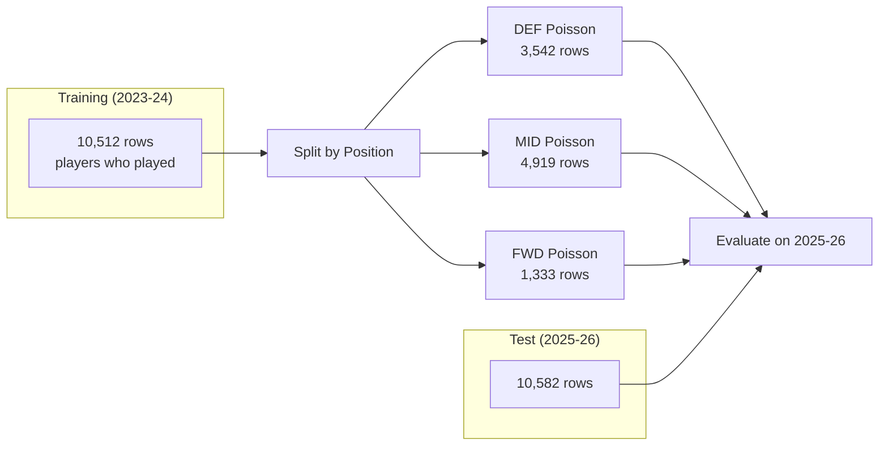

# Goals Prediction Model

## 1. Problem Definition

**Input:** A player + upcoming fixture (conditioned on the player playing)

**Output:** Probability distribution over goals scored:
- P(0 goals) — most likely outcome for any individual GW
- P(1 goal) — scored exactly once
- P(2+ goals) — scored a brace or more

**Conditioning:** The goals model only applies to players who are expected to play. The minutes model determines P(playing) first; this model determines P(goals | playing).

## 2. Modeling Approach: Poisson Regression

The data strongly supports a Poisson model:

| Position | Mean goals/appearance | Variance | Var/Mean ratio |
|----------|----------------------|----------|----------------|
| DEF | 0.037 | 0.038 | 1.03 |
| MID | 0.111 | 0.120 | 1.08 |
| FWD | 0.251 | 0.269 | 1.07 |

A ratio of ~1.0 indicates equidispersion — the hallmark of Poisson-distributed data.

**Why Poisson over classification?**

- Goals are rare events (91% of appearances have 0 goals)
- Poisson naturally handles count data with a single parameter (λ)
- From λ, we can derive any probability: P(k goals) = e^{-λ} × λ^k / k!
- Predicting λ is a regression problem — easier and more informative than multinomial classification

**Pipeline:**

```mermaid
graph LR
    FEATURES[Player features<br/>xG, shots, opponent, etc.] --> LGBM[LightGBM<br/>Poisson objective]
    LGBM --> LAMBDA[λ = expected goals rate]
    LAMBDA --> PMF[Poisson PMF]
    PMF --> P0[P(0 goals)]
    PMF --> P1[P(1 goal)]
    PMF --> P2[P(2+ goals)]
```

## 3. Feature Set (26 features)

#### xG Features (strongest predictors)

| Feature | Description |
|---------|-------------|
| `expected_goals_roll3` | Average xG in last 3 GWs |
| `expected_goals_roll5` | Average xG in last 5 GWs |
| `expected_goals_roll10` | Average xG in last 10 GWs |
| `expected_goals_sum3` | Total xG in last 3 GWs |
| `expected_goals_sum5` | Total xG in last 5 GWs |
| `expected_goals_per90_roll5` | xG per 90 minutes over last 5 GWs |
| `expected_goals_per90_roll10` | xG per 90 minutes over last 10 GWs |
| `expected_goals_season_avg` | Season-to-date average xG per appearance |

#### Goals History

| Feature | Description |
|---------|-------------|
| `goals_scored_roll3` | Average goals in last 3 GWs |
| `goals_scored_roll5` | Average goals in last 5 GWs |
| `goals_scored_roll10` | Average goals in last 10 GWs |
| `goals_scored_sum5` | Total goals in last 5 GWs |
| `goals_scored_sum10` | Total goals in last 10 GWs |
| `goals_scored_per90_roll5` | Goals per 90 over last 5 GWs |
| `goals_scored_per90_roll10` | Goals per 90 over last 10 GWs |
| `goals_scored_season_avg` | Season-to-date average goals per appearance |

#### Minutes & Context

| Feature | Description |
|---------|-------------|
| `minutes_roll3` | Average minutes in last 3 GWs (more minutes = more opportunity) |
| `minutes_roll5` | Average minutes in last 5 GWs |
| `is_home` | Home advantage (1) or away (0) |
| `season_progress` | Position in season (0.0 to 1.0) |

#### Match Difficulty

| Feature | Description |
|---------|-------------|
| `match_difficulty` | Opponent's overall strength (higher = harder to score against) |
| `prev_match_difficulty` | Difficulty of the previous fixture |
| `next_match_difficulty` | Difficulty of the upcoming fixture |

#### Other

| Feature | Description |
|---------|-------------|
| `threat_roll3` | FPL "threat" metric averaged over last 3 GWs |
| `threat_roll5` | FPL "threat" metric averaged over last 5 GWs |
| `value_vs_pos_avg` | Player price relative to position average (z-score) |

## 4. Training Setup



**Key differences from Minutes model:**

| Aspect | Minutes model | Goals model |
|--------|--------------|-------------|
| Objective | Multi-class classification | Poisson regression |
| Filter | All players | Only players who played (minutes > 0) |
| Target | minutes_category (0, 1, 2) | goals_scored (0, 1, 2, 3, ...) |
| Output | Class probabilities | λ → Poisson PMF → probabilities |
| Calibration | Isotonic regression | Inherent in Poisson parameterization |

**Hyperparameters:**

| Parameter | Value | Rationale |
|-----------|-------|-----------|
| `objective` | `poisson` | Native Poisson loss in LightGBM |
| `n_estimators` | 500 | Sufficient capacity |
| `max_depth` | 5 | Shallower than minutes (less data per position) |
| `learning_rate` | 0.03 | Conservative for small FWD dataset |
| `num_leaves` | 20 | Conservative tree complexity |
| `min_child_samples` | 100 | Prevents overfitting to rare events |
| `reg_alpha` | 0.1 | L1 regularization |
| `reg_lambda` | 0.1 | L2 regularization |

## 5. Results

#### Per-Position Performance (Test: 2025-26 season)

| Position | Mean λ predicted | Mean goals actual | MAE | RMSE |
|----------|-----------------|------------------|-----|------|
| **DEF** | 0.045 | 0.036 | 0.077 | 0.202 |
| **MID** | 0.112 | 0.100 | 0.182 | 0.322 |
| **FWD** | 0.245 | 0.234 | 0.362 | 0.504 |

#### Calibration (predicted probability vs actual frequency)

| Position | P(0 goals) pred/actual | P(1 goal) pred/actual | P(2+ goals) pred/actual |
|----------|----------------------|----------------------|------------------------|
| **DEF** | 0.957 / 0.966 | 0.041 / 0.031 | 0.002 / 0.002 |
| **MID** | 0.898 / 0.907 | 0.093 / 0.087 | 0.009 / 0.006 |
| **FWD** | 0.794 / 0.801 | 0.174 / 0.166 | 0.033 / 0.033 |

Calibration is excellent — predicted probabilities match actual frequencies within 1-2% across all positions and classes.

#### Feature Importance (Top 5 per position)

| Rank | DEF | MID | FWD |
|------|-----|-----|-----|
| 1 | xG season avg | match difficulty | minutes roll3 |
| 2 | prev match difficulty | value vs pos avg | xG per90 roll10 |
| 3 | xG per90 roll10 | xG per90 roll10 | match difficulty |
| 4 | minutes roll5 | xG season avg | goals per90 roll10 |
| 5 | xG roll10 | minutes roll5 | threat roll3 |

**Interpretation:**
- **xG per90 rolling** is universally important — the best predictor of future goals is recent shot quality
- **Match difficulty** is crucial for MID and FWD — players score more against weaker defences
- **For DEF**, previous match difficulty matters (set-piece patterns carry over)
- **For FWD**, recent minutes and form (threat) matter most — a FWD on a hot streak keeps scoring

#### Sample Predictions (correctly identifies top scorers)

| Player | Position | λ predicted | Interpretation |
|--------|----------|-------------|---------------|
| Palmer | MID | 1.50 | ~78% chance of scoring in that GW |
| Gyökeres | FWD | 1.28 | ~72% chance of scoring |
| Haaland | FWD | 1.23 | ~71% chance of scoring |
| Saka | MID | 0.80 | ~55% chance of scoring |
| Porro | DEF | 0.44 | ~36% chance of scoring (attacking fullback) |

## 6. How Minutes and Goals Combine

For the downstream simulation engine, these models combine as:

```
P(player scores k goals in GW) = P(plays) × P(k goals | plays)

Example: Haaland in GW17
  Minutes model: P(60+ min) = 0.92, P(1-59 min) = 0.05, P(0 min) = 0.03
  Goals model:   λ = 1.23 → P(0) = 0.29, P(1) = 0.36, P(2+) = 0.35

  Combined P(scores ≥ 1 goal) = 0.97 × 0.71 = 0.69
  Combined P(exactly 1 goal) = 0.97 × 0.36 = 0.35
  Combined P(2+ goals) = 0.97 × 0.35 = 0.34
```

## 7. Additional Module: `match_context.py`

Built alongside the goals model, this feature module is shared across models.

Location: `src/fpl_engine/features/match_context.py`

#### Match Difficulty Functions

| Function | Output columns | Description |
|----------|---------------|-------------|
| `add_match_difficulty(df, fixtures_df, teams_df)` | `match_difficulty`, `match_difficulty_band` | Current fixture difficulty from opponent strength |
| `add_surrounding_difficulty(df, fixtures_df, teams_df)` | `prev_match_difficulty`, `next_match_difficulty`, `difficulty_change`, `sandwich_score` | Difficulty of adjacent fixtures (rest/rotation signals) |

#### Squad Depth Functions

| Function | Output columns | Description |
|----------|---------------|-------------|
| `add_squad_depth(df)` | `squad_depth_position`, `competitors_played`, `position_minutes_share`, `is_primary_choice` | Competition for places at the player's position within their team |
| `add_rolling_squad_depth(df, windows)` | `competitors_played_roll{N}`, `position_minutes_share_roll{N}`, `is_primary_choice_roll{N}` | Trailing averages of squad depth metrics |

## 8. Model Artifacts

| File | Description |
|------|-------------|
| `models/goals_v1/models.pkl` | Dict of position → LGBMRegressor (Poisson) |
| `models/goals_v1/feature_columns.pkl` | Ordered list of 26 feature column names |

**Usage:**
```
from fpl_engine.models.goals import GoalsModel

model = GoalsModel.load("models/goals_v1")
predictions = model.predict(featured_df)
# Returns: element, position, lambda_goals, p_0_goals, p_1_goal, p_2plus_goals
```
