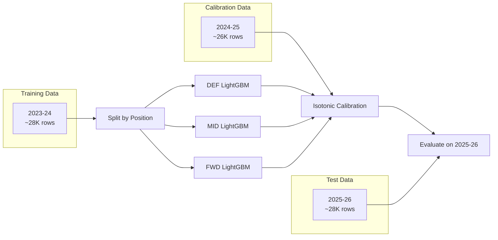
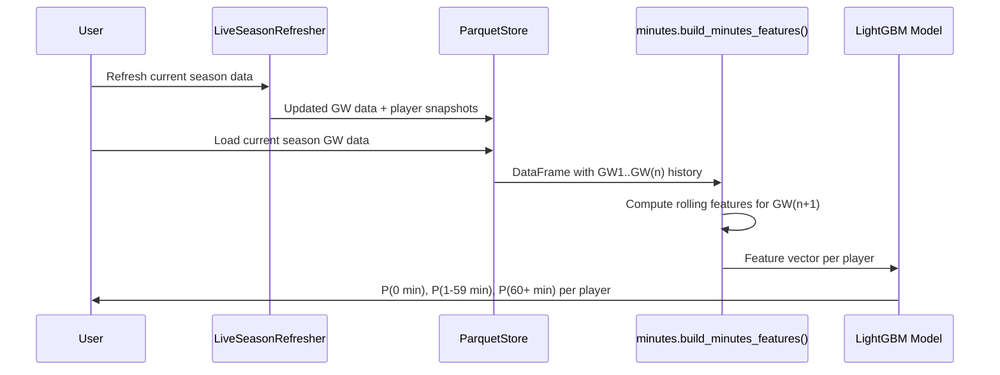

# Minutes Prediction Model (v2)

## 1. Problem Definition

**Input:** A player + upcoming fixture + optional PlayerContext

**Output:** Calibrated probability distribution over three outcomes:
- P(0 minutes) — player does not appear
- P(1-59 minutes) — player is substituted on/off
- P(60+ minutes) — player plays a full or near-full match

**Architecture:** Position-specific models with isotonic calibration

| Position | Model Type | Rationale |
|----------|-----------|-----------|
| DEF | LightGBM 3-class | Defenders have distinct patterns (CBs rarely sub, fullbacks rotate more) |
| MID | LightGBM 3-class | Largest, most varied group |
| FWD | LightGBM 3-class | Strikers have highest rotation (fewer per squad) |
| GK | Rule-based | Nearly always 90 or 0 — sub GK is <0.5% of cases |

### 1.2 Target Variable

```
minutes_category:
    0 = Did not play (0 minutes)
    1 = Substitute appearance (1-59 minutes)
    2 = Full match (60+ minutes)
```

Distribution in training data:

| Class | Count | Percentage |
|-------|-------|-----------|
| 0: No play | ~49,400 | 60.9% |
| 1: Sub | ~10,100 | 12.4% |
| 2: Full | ~21,600 | 26.7% |

The class imbalance (60% "no play") is addressed with inverse-frequency sample weights during training.

### 1.3 Feature Set

The model uses 29 features grouped into categories:

#### Rolling Minutes History

| Feature | Description |
|---------|-------------|
| `minutes_roll3` | Average minutes in last 3 GWs |
| `minutes_roll5` | Average minutes in last 5 GWs |
| `minutes_roll10` | Average minutes in last 10 GWs |
| `starts_roll3` | Average starts (0/1) in last 3 GWs |
| `starts_roll5` | Average starts in last 5 GWs |
| `starts_roll10` | Average starts in last 10 GWs |
| `starts_sum3` | Total starts in last 3 GWs |
| `starts_sum5` | Total starts in last 5 GWs |

#### Start / Play Percentages

| Feature | Description |
|---------|-------------|
| `started_60plus_pct3` | % of last 3 GWs with 60+ minutes |
| `started_60plus_pct5` | % of last 5 GWs with 60+ minutes |
| `started_60plus_pct10` | % of last 10 GWs with 60+ minutes |
| `played_any_pct3` | % of last 3 GWs with any minutes |
| `played_any_pct5` | % of last 5 GWs with any minutes |
| `played_any_pct10` | % of last 10 GWs with any minutes |

#### Availability & Season Pattern

| Feature | Description |
|---------|-------------|
| `availability_rate5` | Fraction of last 5 GWs played |
| `availability_rate10` | Fraction of last 10 GWs played |
| `availability_rate38` | Fraction of all season GWs played |
| `minutes_season_avg` | Season-to-date average minutes |

#### Fixture Context

| Feature | Description |
|---------|-------------|
| `is_home` | Home (1) or away (0) |
| `days_rest` | Days since last match |
| `matches_played_last3` | Matches played in last 3 GWs |
| `matches_played_last5` | Matches played in last 5 GWs |
| `season_progress` | Position in season (0.0 to 1.0) |
| `is_dgw` | Double Gameweek indicator |

#### Player Profile

| Feature | Description |
|---------|-------------|
| `pos_DEF` | Is Defender (one-hot) |
| `pos_FWD` | Is Forward (one-hot) |
| `pos_GK` | Is Goalkeeper (one-hot) |
| `pos_MID` | Is Midfielder (one-hot) |
| `value_vs_pos_avg` | Price relative to position average (z-score) |

### 1.4 Training Setup



**Split strategy:** Three-way temporal split:
- **Train (2023-24):** Learn patterns
- **Calibration (2024-25):** Fit isotonic regression to align probabilities
- **Test (2025-26):** Final evaluation on unseen season

This is more rigorous than train/test — the calibration set ensures we don't overfit the probability alignment to the test set.

**Hyperparameters:**

| Parameter | Value | Rationale |
|-----------|-------|-----------|
| `n_estimators` | 500 | Enough capacity without overfitting |
| `max_depth` | 6 | Prevents overly complex trees |
| `learning_rate` | 0.05 | Conservative, allows fine-tuning |
| `num_leaves` | 31 | Standard for depth-6 trees |
| `subsample` | 0.8 | Row subsampling for regularization |
| `colsample_bytree` | 0.8 | Feature subsampling for regularization |
| `min_child_samples` | 50 | Prevents splits on too few observations |
| `class_weight` | Inverse frequency | Addresses 61%/12%/27% imbalance |

**Missing value handling:** NaN features (from first few GWs with insufficient history) are filled with 0. LightGBM natively handles missing values, but filling ensures consistent behavior.

**Rows dropped:** Gameweeks 1-3 are excluded per player (insufficient rolling history for features).

### 1.5 Results (v2 — Position-Specific with Calibration)

#### Per-Position Performance (Test: 2025-26 season, calibrated)

| Position | Accuracy | Log Loss | P(0) predicted/actual | P(sub) predicted/actual | P(full) predicted/actual |
|----------|----------|----------|----------------------|------------------------|-------------------------|
| **DEF** | **79.6%** | 0.552 | 0.589 / 0.598 | 0.103 / 0.094 | 0.308 / 0.309 |
| **MID** | **77.9%** | 0.538 | 0.581 / 0.603 | 0.168 / 0.155 | 0.251 / 0.242 |
| **FWD** | **73.8%** | 0.615 | 0.553 / 0.565 | 0.193 / 0.202 | 0.254 / 0.233 |

**Key observations:**
- Calibration is excellent — predicted probabilities are within 1-2% of actual frequencies
- DEF model is strongest (clearest starter/non-starter patterns)
- FWD model is weakest (most rotation, tactical variation)
- MID model handles the largest group with good calibration

#### Detailed Per-Class (DEF model)

| Class | Precision | Recall | F1-Score | Support |
|-------|-----------|--------|----------|---------|
| 0: No play | 84.1% | 89.7% | 86.8% | 5,400 |
| 1: Sub (1-59 min) | 28.9% | 1.5% | 2.9% | 847 |
| 2: Full (60+ min) | 72.1% | 83.6% | 77.4% | 2,789 |

#### Detailed Per-Class (MID model)

| Class | Precision | Recall | F1-Score | Support |
|-------|-----------|--------|----------|---------|
| 0: No play | 89.2% | 88.3% | 88.7% | 7,461 |
| 1: Sub (1-59 min) | 44.3% | 25.9% | 32.7% | 1,912 |
| 2: Full (60+ min) | 66.1% | 85.3% | 74.5% | 2,994 |

#### Detailed Per-Class (FWD model)

| Class | Precision | Recall | F1-Score | Support |
|-------|-----------|--------|----------|---------|
| 0: No play | 86.6% | 87.6% | 87.1% | 1,728 |
| 1: Sub (1-59 min) | 46.4% | 29.2% | 35.9% | 619 |
| 2: Full (60+ min) | 61.1% | 79.0% | 68.9% | 714 |

#### GK Handling

Goalkeepers use rule-based prediction:
- If `availability_rate > 0.8` → P(full) ≈ 0.95, P(sub) ≈ 0.02, P(no play) ≈ 0.03
- If `chance_of_playing_pct` is available from API → use directly
- If availability is low → P(no play) ≈ 0.95

This is justified because GKPs have an almost binary distribution (90 or 0), with sub appearances accounting for less than 0.5% of cases.

---

## 2. Inference (Using the Model for Predictions)

### How to predict minutes for an upcoming GW



**Steps for inference:**

1. Run `scripts/refresh.py` to get latest GW data
2. Load current season gameweeks from ParquetStore
3. For each player, the most recent row's rolling features represent "current state"
4. Pass features through the model to get probabilities
5. Output: a probability distribution for every player

### Example output

| Player | P(0 min) | P(1-59 min) | P(60+ min) |
|--------|----------|-------------|------------|
| Haaland | 0.03 | 0.05 | 0.92 |
| Palmer | 0.04 | 0.12 | 0.84 |
| Bench player | 0.78 | 0.15 | 0.07 |
| Injured player | 0.97 | 0.02 | 0.01 |

---

## 3. Dataset Builder Reference

### `build_training_dataset(store, seasons, min_gw)`

Location: `src/fpl_engine/models/minutes.py`

Builds the full training dataset by loading multi-season GW data, computing features per-season (to avoid cross-season leakage), then concatenating.

| Parameter | Type | Default | Description |
|-----------|------|---------|-------------|
| `store` | `ParquetStore` | required | Storage layer with loaded data |
| `seasons` | `list[str] | None` | all available | Seasons to include |
| `min_gw` | `int` | 4 | Drop early GWs with insufficient rolling history |

**Returns:** DataFrame with 86 columns (original data + features + target).

### `build_minutes_features(df)`

Compute all features for the minutes model from raw GW data.

**Expects columns:** `element`, `gameweek`, `minutes`, `starts`, `position`, `was_home`, `kickoff_time`, `value`

**Returns:** Enriched DataFrame with all feature columns added.

### `build_minutes_target(df)`

Creates the 3-class target variable.

**Returns:** DataFrame with `minutes_category` column (0, 1, or 2).

### `FEATURE_COLUMNS`

List of 29 feature column names used by the trained model. Defined as a constant for consistency between training and inference.

---

## 4. Model Artifacts

| File | Format | Description |
|------|--------|-------------|
| `models/minutes_v2/models.pkl` | joblib | Dict of position → LightGBM classifiers (DEF, MID, FWD) |
| `models/minutes_v2/calibrators.pkl` | joblib | Dict of position → {class_idx: IsotonicRegression} |
| `models/minutes_v2/feature_columns.pkl` | joblib | Ordered list of feature column names |

**Loading and using the model:**
```
from fpl_engine.models.minutes import MinutesModelV2

model = MinutesModelV2.load("models/minutes_v2")
predictions = model.predict_proba(current_season_gw_data, player_contexts=contexts)
# Returns: DataFrame with element, position, p_no_play, p_sub, p_full
```

---

## 5. Known Limitations and Future Improvements

### Addressed in v2 (previously limitations)

| Item | How addressed |
|------|--------------|
| ~~No injury/news features~~ | PlayerContext + availability.py provides 12 injury/fitness features |
| ~~No calibration~~ | Isotonic regression on validation set, calibration within 1-2% of actuals |
| ~~Same model for all positions~~ | Separate DEF/MID/FWD models + GK rule-based |
| ~~No external match context~~ | `days_since_last_match`, `fatigue_score`, `important_match_proximity` |
| ~~Static model, no manual input~~ | PlayerContext supports API + manual overrides with `override()` method |

### Remaining limitations

| Limitation | Impact | Potential fix |
|-----------|--------|---------------|
| No manager rotation patterns | Misses Pep Roulette-style rotation | Add per-manager rotation index feature |
| Sub class still poorly predicted | DEF sub recall is 1.5% | Accept as inherent uncertainty; subs depend on game state |
| Context features not in training data | Model can't learn from them directly | Could scrape historical FPL API snapshots for past `chance_of_playing` |
| No competition-specific features | Ignores whether it's an FA Cup round or important league match | Add match importance weighting |
| Single-season training | Only uses 2023-24 as training | Could use 2+ seasons with careful position mapping |

---

## 6. How to Reproduce

```bash
# 1. Ensure data is loaded
python scripts/run_pipeline.py

# 2. Train the model (from project root)
cd /path/to/fpl
source .venv/bin/activate

python -c "
from fpl_engine.storage.parquet_store import ParquetStore
from fpl_engine.models.minutes import build_training_dataset, FEATURE_COLUMNS
import lightgbm as lgb
import joblib

store = ParquetStore(base_dir='data/processed')
dataset = build_training_dataset(store, seasons=['2023-24', '2024-25', '2025-26'])

train = dataset[dataset['season'].isin(['2023-24', '2024-25'])]
features = [c for c in FEATURE_COLUMNS if c in train.columns]

X = train[features].fillna(0)
y = train['minutes_category']

model = lgb.LGBMClassifier(n_estimators=500, max_depth=6, learning_rate=0.05)
model.fit(X, y)
joblib.dump(model, 'models/minutes_lgbm_v1.pkl')
joblib.dump(features, 'models/minutes_features_v1.pkl')
"

# 3. Predict for upcoming GW
python -c "
import joblib
from fpl_engine.storage.parquet_store import ParquetStore
from fpl_engine.models.minutes import build_minutes_features

model = joblib.load('models/minutes_lgbm_v1.pkl')
features = joblib.load('models/minutes_features_v1.pkl')

store = ParquetStore(base_dir='data/processed')
current = store.load_gameweeks('2025-26')
current = build_minutes_features(current)

# Latest row per player = current state
latest = current.sort_values('gameweek').groupby('element').last()
X = latest[features].fillna(0)
probs = model.predict_proba(X)
print(f'Predictions for {len(probs)} players')
"
```
