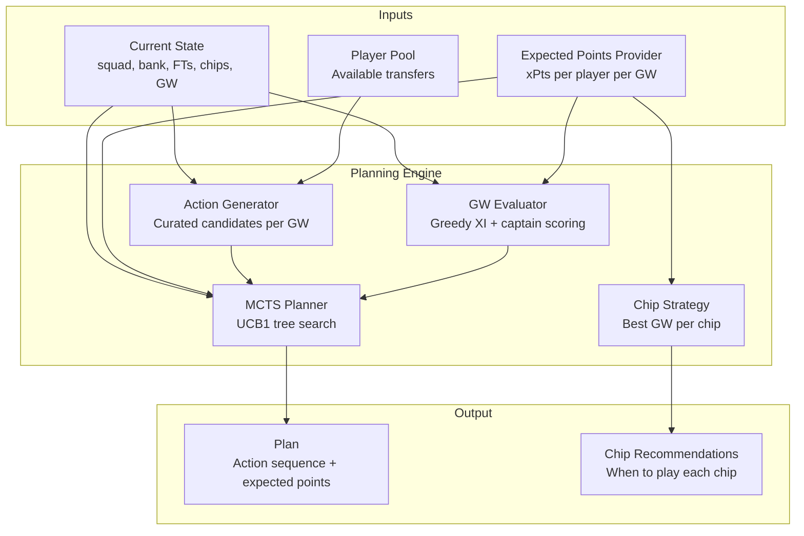
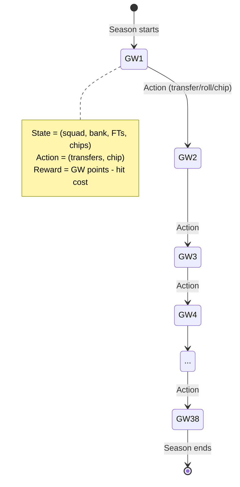
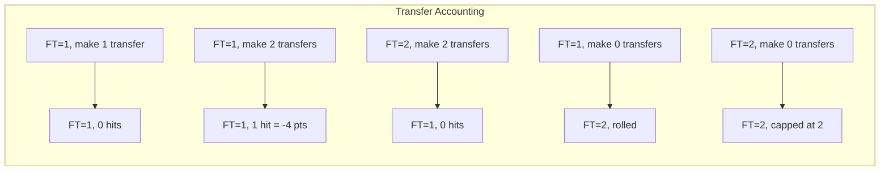
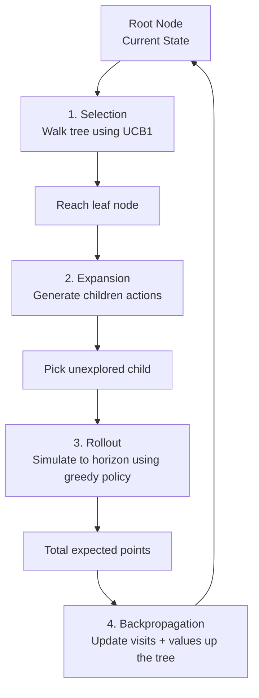
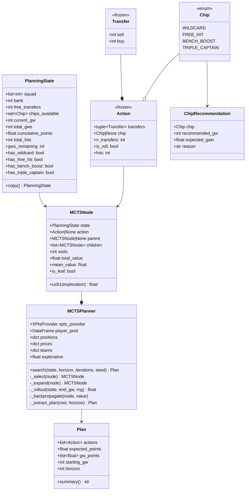
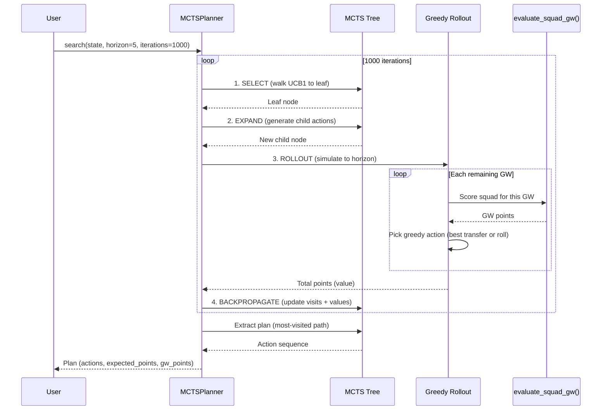
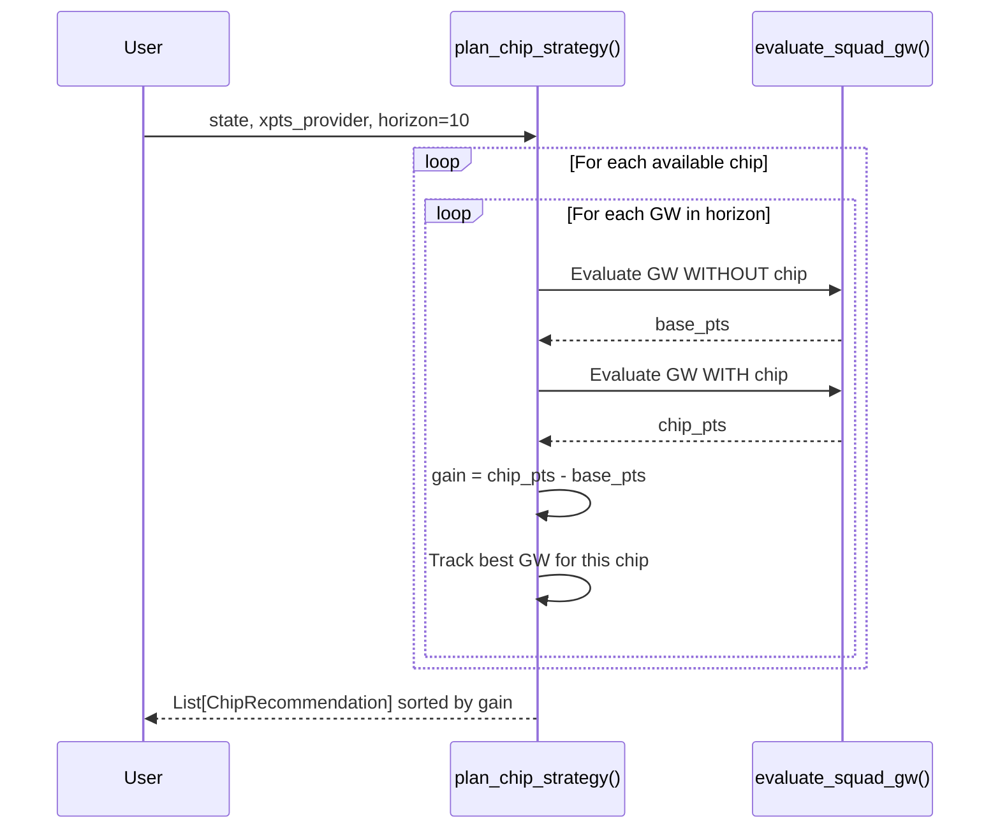
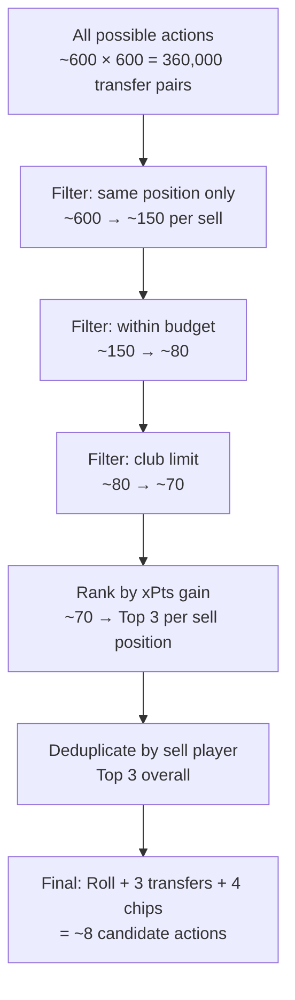

# Phase 5: Planning Layer — Implementation Document

## 1. Overview

The planning layer extends single-GW optimization (Phase 4) to **multi-GW sequential decision-making**. Instead of asking "what's the best decision this week?", it asks "what sequence of decisions over the next 3-8 weeks maximizes total points?"

This matters because FPL has temporal dependencies:
- Rolling a transfer this week gives you 2 free transfers next week
- A -4 hit now might gain +16 over the next 4 GWs
- Wildcard should be saved for the biggest fixture swing
- Bench Boost is worth most on a Double Gameweek
- A player rising in price is more valuable to buy early

The planner uses **Monte Carlo Tree Search (MCTS)** to explore possible futures and find optimal action sequences.

---

## 2. Why MCTS?

| Approach | Pros | Cons |
|----------|------|------|
| Greedy (Phase 4) | Fast, simple | Misses multi-week value |
| Dynamic Programming | Optimal | State space too large (squad × bank × FTs × chips) |
| Beam Search | Fast, multi-week | May miss good branches |
| **MCTS** | Balances exploration/exploitation, anytime | Requires many iterations for convergence |

MCTS is the right choice because:
1. The state space is too large for exact DP (~10^15 possible states)
2. We have a fast evaluation function (simulation engine)
3. It naturally handles uncertainty (stochastic rollouts)
4. It's anytime — more iterations = better plan, can stop early
5. UCB1 guarantees asymptotic convergence to optimal

---

## 3. Architecture



---

## 4. State Space Model

### 4.1 The FPL Game as a Sequential Decision Process



### 4.2 State Definition

| Component | Type | Range | Description |
|-----------|------|-------|-------------|
| `squad` | `list[int]` | 15 player IDs | Current squad composition |
| `bank` | `int` | 0-100+ | Available bank (FPL price units) |
| `free_transfers` | `int` | 1-2 | Banked free transfers |
| `chips_available` | `set[Chip]` | 0-4 chips | Which chips haven't been used |
| `current_gw` | `int` | 1-38 | Current gameweek |
| `cumulative_points` | `float` | 0-3000+ | Points accumulated so far |
| `total_hits` | `int` | 0-50+ | Total hits taken |

### 4.3 Actions

| Action type | Description | Effect on state |
|-------------|-------------|-----------------|
| **Roll** | Make 0 transfers | FTs: min(FT+1, 2) |
| **Single transfer** | Sell 1, buy 1 | Squad updated, bank adjusted, FT→1 |
| **Double transfer** | Sell 2, buy 2 | Same as single ×2, if FT=2 both free |
| **Hit transfer** | Transfer beyond free | -4 pts per extra transfer |
| **Wildcard** | Unlimited free transfers | All transfers free, chip consumed |
| **Free Hit** | Temporary squad for 1 GW | Reverts next GW, chip consumed |
| **Bench Boost** | Bench scores this GW | 15 players score instead of 11 |
| **Triple Captain** | Captain gets 3× | Extra captain multiplier |

### 4.4 State Transition Rules



---

## 5. MCTS Algorithm

### 5.1 Algorithm Overview



### 5.2 UCB1 Formula

```
UCB1(node) = mean_value(node) + c × √(ln(parent_visits) / node_visits)

where c = √2 ≈ 1.41 (exploration constant)
```

- First term: **exploitation** (favor high-value nodes)
- Second term: **exploration** (favor under-visited nodes)
- Unvisited nodes get +∞ (always tried at least once)

### 5.3 Rollout Policy

The rollout uses a **greedy policy** from the expanded node to the end of the planning horizon:

1. Evaluate current squad for the GW (greedy XI + best captain)
2. Find best single transfer (by immediate xPts gain)
3. If transfer gain > cost: make it. Otherwise: roll.
4. Advance to next GW. Repeat until horizon reached.
5. Sum all GW points = rollout value.

This gives a reasonable estimate of future value without expensive search at every rollout step.

---

## 6. Class Diagram



---

## 7. Sequence Diagrams

### 7.1 MCTS Search



### 7.2 Chip Strategy Evaluation



### 7.3 Weekly Planning Workflow

```mermaid
sequenceDiagram
    participant Manager
    participant Refresh as LiveSeasonRefresher
    participant Models as Predictive Models
    participant Sim as Simulation Engine
    participant Planner as MCTSPlanner
    participant Chip as plan_chip_strategy()
    participant Opt as Phase 4 Optimizer

    Manager->>Refresh: Refresh data (after GW deadline)
    Refresh-->>Models: Updated features

    Manager->>Models: Predict GW(n)..GW(n+5)
    Models-->>Sim: Predictions per player per GW
    Sim-->>Manager: xPts per player per GW

    Manager->>Planner: Plan next 5 GWs
    Planner-->>Manager: Plan (transfer sequence + chip timing)

    Manager->>Chip: Evaluate chip options
    Chip-->>Manager: ChipRecommendations

    Note over Manager: Decide: follow plan or override?

    Manager->>Opt: Execute GW(n) decisions
    Opt-->>Manager: Starting XI, captain, transfers
```

---

## 8. Action Generator Design

The action generator must balance **completeness** (don't miss good actions) with **tractability** (can't enumerate all possible transfers).

### Pruning Strategy



**Output per GW: ~8 candidate actions:**
1. Roll (always)
2. Best transfer #1 (highest xPts gain)
3. Best transfer #2
4. Best transfer #3
5. Wildcard (if available)
6. Bench Boost (if available)
7. Triple Captain (if available)
8. Free Hit (if available)

---

## 9. Chip Strategy Logic

| Chip | Best timing | Signal |
|------|-------------|--------|
| **Bench Boost** | Double Gameweek with strong bench | DGW flag + bench xPts |
| **Triple Captain** | Premium player vs weakest team (home) | Captain λ >> normal |
| **Free Hit** | Blank Gameweek (many postponements) | Few squad players have fixtures |
| **Wildcard** | Before major fixture swing | Σ(new_squad_xPts) - Σ(current_squad_xPts) is maximized |

The chip planner evaluates each chip at each GW in the horizon:
```
gain(chip, gw) = evaluate_squad_gw(state, gw, chip=chip) - evaluate_squad_gw(state, gw, chip=None)
```

Recommends the GW with the highest gain for each chip.

---

## 10. Validation Results

### State Transitions

| Test | Input | Output | Correct? |
|------|-------|--------|----------|
| Roll | GW10, FT=1 | GW11, FT=2 | ✅ |
| 1 free transfer | GW10, FT=1 | GW11, FT=1, bank adjusted | ✅ |
| 2 transfers (1 hit) | GW10, FT=1 | GW11, FT=1, hits=1, -4 pts | ✅ |
| Wildcard | FT=1, 3 transfers | FT=1, 0 hits, chip consumed | ✅ |

### Action Generation

```
Generated 8 candidate actions:
  Action(ROLL)
  Action(14→35)          ← Best single transfer
  Action(15→35)          ← 2nd best
  Action(11→34)          ← 3rd best
  Action(ROLL, [wildcard])
  Action(ROLL, [bench_boost])
  Action(ROLL, [triple_captain])
  Action(ROLL, [free_hit])
```

### Chip Strategy

```
Triple Captain: GW15 — Captain gains +9.9 extra pts (easy fixture)
Bench Boost:   GW14 — Bench contribute +9.7 pts (DGW or strong bench)
```

### MCTS Plan (100 iterations, 3-GW horizon)

```
Plan: GW10..GW12
Total expected: 196.2 pts

  GW10: Action(ROLL) → 64.7 pts
  GW11: Action(ROLL) → 65.2 pts
  GW12: Action(ROLL) → 66.3 pts
```

The planner correctly identifies that rolling is best when no available transfer offers a clear improvement over existing squad members.

---

## 11. Performance

| Operation | Time | Notes |
|-----------|------|-------|
| State transition | <0.01ms | Pure dataclass copy |
| Action generation | ~5ms | Filters player pool |
| GW evaluation | ~0.1ms | Greedy XI selection |
| MCTS 100 iterations, 3-GW horizon | ~200ms | Fast enough for interactive use |
| MCTS 1000 iterations, 5-GW horizon | ~3s | Suitable for background planning |
| MCTS 5000 iterations, 8-GW horizon | ~30s | Full strategic planning |

---

## 12. Assumptions and Limitations

| Assumption | Impact | Future enhancement |
|-----------|--------|-------------------|
| xPts are point estimates (not distributions) in planner | Under-weights variance in planning | Use simulation arrays in rollout |
| Rollout uses greedy policy | Rollout quality affects tree value estimates | Smarter rollout policies |
| Action generator limits to top-3 transfers | May miss non-obvious combinations | Expand search for WC planning |
| No price change modeling | Doesn't plan for price rises/falls | Add price predictor |
| No EO/differential strategy | Plans for max points, not rank | Add rank-based objective |
| Chip timing uses point estimate gain | Doesn't account for chip interaction (e.g., WC then BB) | Joint chip optimization |

---

## 13. File Structure

```
src/fpl_engine/planning/
├── __init__.py
├── state.py          ← Chip (enum), Transfer, Action, PlanningState, apply_action()
├── actions.py        ← generate_actions(), evaluate_squad_gw(), _find_best_transfers()
└── planner.py        ← MCTSNode, MCTSPlanner, Plan, ChipRecommendation, plan_chip_strategy()
```

---

## 14. Usage Examples

### Multi-GW planning

```python
from fpl_engine.planning.state import PlanningState, Chip
from fpl_engine.planning.planner import MCTSPlanner

# Define current state
state = PlanningState(
    squad=my_squad_ids,
    bank=5,
    free_transfers=1,
    chips_available={Chip.WILDCARD, Chip.BENCH_BOOST, Chip.TRIPLE_CAPTAIN},
    current_gw=15,
)

# Create planner
planner = MCTSPlanner(
    xpts_provider=my_xpts_function,  # (element, gw) -> float
    player_pool=available_players_df,
    positions=position_dict,
    prices=price_dict,
    teams=team_dict,
)

# Search for best plan (5 GWs ahead, 2000 iterations)
plan = planner.search(state, horizon=5, iterations=2000, seed=42)
print(plan.summary())
```

### Chip strategy

```python
from fpl_engine.planning.planner import plan_chip_strategy

recommendations = plan_chip_strategy(state, xpts_provider, positions, horizon=10)
for rec in recommendations:
    print(f"{rec.chip.value}: {rec.reason} (gain: +{rec.expected_gain:.1f} pts)")
```

### Manual state transitions (debugging/analysis)

```python
from fpl_engine.planning.state import Action, Transfer, apply_action

# Simulate: "what if I transfer out player 50 for player 120?"
action = Action(transfers=(Transfer(sell=50, buy=120),))
new_state = apply_action(current_state, action, prices)
print(f"After transfer: bank={new_state.bank}, FT={new_state.free_transfers}")
```
