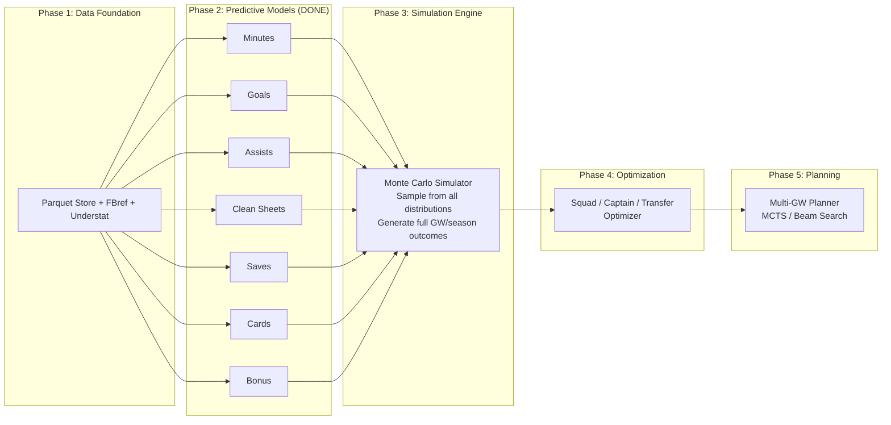

# Phase 2: Predictive Models — Overview

## 1. Overview

Phase 2 builds probabilistic prediction models for FPL-relevant player outcomes. Rather than predicting a single "expected points" number directly, we decompose FPL scoring into its individual components and model each one separately. The component predictions are then combined to produce a full points distribution.

Each model is documented in its own file under `docs/models/`.

---

## 2. Model Inventory

| Model | Type | Output | Conditions | Doc |
|-------|------|--------|-----------|-----|
| **Minutes** | 3-class classification (per position) | P(0 min), P(1-59 min), P(60+ min) | — | [minutes-model.md](models/minutes-model.md) |
| **Goals** | Poisson regression (per position) | λ → P(0), P(1), P(2+) goals | Conditioned on playing | [goals-model.md](models/goals-model.md) |
| **Assists** | Poisson regression (per position) | λ → P(0), P(1), P(2+) assists | Conditioned on playing | [assists-model.md](models/assists-model.md) |
| **Clean Sheets** | Binary classification | P(team CS) | Conditioned on 60+ min | [clean-sheets-model.md](models/clean-sheets-model.md) |
| **Saves** | Poisson regression (GK only) | λ → FPL save points | Conditioned on GK playing 60+ min | [saves-model.md](models/saves-model.md) |
| **Cards** | Binary classification (per position) | P(yellow), P(red) | Conditioned on playing | [cards-model.md](models/cards-model.md) |
| **Bonus** | Regression (per position) | E[bonus] (0-3) | Conditioned on playing | [bonus-model.md](models/bonus-model.md) |

---

## 3. Architecture

```mermaid
graph TD
    subgraph "Data Foundation (Phase 1)"
        STORE[ParquetStore<br/>Historical GW data]
        FBREF[FBref Data<br/>Opposition stats]
        UNDERSTAT[Understat Data<br/>xG/xA]
    end

    subgraph "External Inputs"
        FPL_API_CTX[FPL API<br/>chance_of_playing, status, news]
        MANUAL[Manual Overrides<br/>injury details, external matches]
    end

    subgraph "Shared Feature Utilities"
        ROLLING[rolling.py<br/>Rolling window aggregations]
        PER90[per90.py<br/>Minutes-adjusted metrics]
        CONTEXT[context.py<br/>Fixture context features]
        MATCH_CTX[match_context.py<br/>Match difficulty, squad depth]
        OPPONENT[opponent.py<br/>Opponent strength adjustment]
        OPP_FEAT[opposition_features.py<br/>Detailed opposition profiling]
        AVAIL[availability.py<br/>Injury/fatigue/rest features]
    end

    subgraph "PlayerContext"
        PCTX[PlayerContext dataclass<br/>API + manual override container]
    end

    subgraph "Component Models"
        MINUTES[Minutes Model<br/>P(0), P(1-59), P(60+)]
        GOALS[Goals Model<br/>λ goals]
        ASSISTS[Assists Model<br/>λ assists]
        CS[Clean Sheets Model<br/>P(team CS)]
        SAVES[Saves Model<br/>λ saves]
        CARDS[Cards Model<br/>P(YC), P(RC)]
        BONUS[Bonus Model<br/>E(bonus)]
    end

    subgraph "Phase 3: Simulation"
        SIM[Monte Carlo Simulator<br/>Sample from all distributions]
    end

    STORE --> ROLLING & PER90 & CONTEXT & MATCH_CTX
    FBREF --> OPP_FEAT
    UNDERSTAT --> OPP_FEAT
    FPL_API_CTX --> PCTX
    MANUAL --> PCTX
    PCTX --> AVAIL

    ROLLING --> MINUTES & GOALS & ASSISTS & CS & SAVES & CARDS & BONUS
    PER90 --> GOALS & ASSISTS
    CONTEXT --> MINUTES & CARDS
    MATCH_CTX --> GOALS & ASSISTS & CS
    OPP_FEAT --> GOALS & ASSISTS & CS
    AVAIL --> MINUTES

    MINUTES --> SIM
    GOALS --> SIM
    ASSISTS --> SIM
    CS --> SIM
    SAVES --> SIM
    CARDS --> SIM
    BONUS --> SIM
```

---

## 4. Design Decisions

### Why decompose FPL points into components?

FPL points are a composite of many events:

```
Points = f(minutes) + f(goals) + f(assists) + f(clean_sheets) + f(saves) + f(bonus) - f(cards)
```

Modeling each component separately gives us:

- **Interpretability** — we can explain why a prediction is high
- **Better uncertainty** — we get a full distribution, not just a mean
- **Modularity** — each model can be improved independently
- **Simulation readiness** — the simulation engine (Phase 3) samples from these distributions

### Why not a separate feature engineering stage?

Each component model has different input requirements. Features that predict minutes (rotation risk, congestion) are different from those that predict goals (xG, opponent defensive weakness). Feature computation lives as **shared utility functions** that each model calls during its own pipeline.

### Conditioning chain

The models form a dependency chain:

```
Minutes → {Goals, Assists, CS, Saves, Cards, Bonus}
```

Minutes is the foundation. All other models are **conditioned on the player playing**:
- P(goals) only applies if the player is on the pitch
- P(CS) requires 60+ minutes
- P(saves) only applies to GKs who play

This is computed as: `P(outcome) = P(plays) × P(outcome | plays)`

---

## 5. Shared Feature Utilities

All feature modules live in `src/fpl_engine/features/` and are stateless functions that enrich DataFrames.

| Module | Purpose | Key functions |
|--------|---------|--------------|
| `rolling.py` | Rolling window aggregations (mean, sum, std, pct) with shift(1) to prevent leakage | `rolling_mean`, `rolling_sum`, `rolling_std`, `rolling_pct`, `cumulative_mean` |
| `per90.py` | Minutes-adjusted metrics and availability rates | `compute_per90`, `compute_rolling_per90`, `compute_availability_rate` |
| `context.py` | Fixture context (home/away, days rest, congestion, DGW, season progress) | `add_home_away`, `add_days_rest`, `add_fixture_congestion`, `add_season_progress`, `add_double_gameweek` |
| `match_context.py` | Match difficulty and squad depth | `add_match_difficulty`, `add_surrounding_difficulty`, `add_squad_depth`, `add_rolling_squad_depth` |
| `opponent.py` | Opponent/team strength (from fixture results) | `add_opponent_strength`, `add_team_strength`, `compute_opponent_adjusted` |
| `opposition_features.py` | Detailed opposition profiling (Understat + FBref + GW data) | `build_opponent_defensive_profile`, `compute_team_gk_save_rates`, `identify_penalty_takers`, `compute_defensive_stability` |
| `availability.py` | Injury, fatigue, and rest features from PlayerContext | `inject_player_context`, `inject_player_context_vectorized` |

### Leakage Prevention

All rolling functions use `shift(1)` — the current row's value is **never** included in its own features. This ensures no future information leaks into training or inference.

---

## 6. PlayerContext — External Information Injection

Location: `src/fpl_engine/models/player_context.py`

The `PlayerContext` dataclass is the bridge between external information sources and the models. Any field can be populated from API or set manually.

| Field | Type | Source | Used by |
|-------|------|--------|---------|
| `chance_of_playing` | 0-100 | FPL API / manual | Minutes |
| `status` | enum | FPL API | Minutes |
| `returning_from_injury` | bool | Manual | Minutes |
| `injury_duration_weeks` | float | Manual | Minutes |
| `fitness_level` | 0.0-1.0 | Manual | Minutes |
| `days_since_last_match` | float | API / manual | Minutes |
| `played_minutes_last_match` | int | API / manual | Minutes |
| `important_match_in_days` | float | Manual | Minutes |
| `important_match_type` | str | Manual | Display |

**Sources:** `PlayerContext.from_fpl_bootstrap()` (auto), `ctx.override()` (manual)

---

## 7. Opposition Detail Features

Location: `src/fpl_engine/features/opposition_features.py`

Provides granular opposition profiling beyond the simple "opponent strength" number.

| Feature group | Count | Source | Used by |
|--------------|-------|--------|---------|
| Opponent defensive profile (xGA, npxGA, deep allowed, PPDA) | 6 | Understat team data | Goals, Assists |
| Opponent GK save rate | 2 | GW saves/goals data | Goals |
| Penalty taker flags | 2 | Understat (goals - npg) | Goals |
| Defensive partnership stability | 4 | DEF appearance patterns | CS, Goals, Assists |
| **Total** | **14** | | |

See [opposition detail documentation](models/opposition-features.md) for full details.

---

## 8. Results Summary

| Model | Position | Key Metric | Calibration Quality |
|-------|----------|-----------|-------------------|
| Minutes | DEF | 79.6% accuracy | Isotonic, within 1-2% |
| Minutes | MID | 77.9% accuracy | Isotonic, within 1-2% |
| Minutes | FWD | 73.8% accuracy | Isotonic, within 1-2% |
| Goals | DEF | λ=0.045 (actual 0.036) | P(0): 0.957 vs 0.966 |
| Goals | MID | λ=0.112 (actual 0.100) | P(0): 0.898 vs 0.907 |
| Goals | FWD | λ=0.245 (actual 0.234) | P(0): 0.794 vs 0.801 |
| Assists | DEF | λ=0.050 (actual 0.061) | P(0): 0.952 vs 0.941 |
| Assists | MID | λ=0.119 (actual 0.111) | P(0): 0.891 vs 0.896 |
| Assists | FWD | λ=0.105 (actual 0.077) | P(0): 0.904 vs 0.928 |
| Clean Sheets | All | AUC 0.627 | Brier 0.198 |
| Saves | GK | λ=2.96 (actual 2.82) | FPL pts within 2% |
| Cards | DEF | AUC 0.548 | Rates within 1-2% |
| Cards | MID | AUC 0.573 | Rates within 1-2% |
| Bonus | All | R²≈0, MAE 0.30-0.57 | Mean within 0.01-0.04 |

---

## 9. Directory Structure

```
src/fpl_engine/
├── features/
│   ├── rolling.py              ← Rolling window aggregations
│   ├── per90.py                ← Minutes-adjusted metrics
│   ├── context.py              ← Fixture context features
│   ├── match_context.py        ← Match difficulty + squad depth
│   ├── opponent.py             ← Opponent strength (from fixtures)
│   ├── opposition_features.py  ← Detailed opposition (Understat + FBref)
│   ├── availability.py         ← Injury/fatigue/rest features
│   └── fixture_difficulty.py   ← Team strength & FDR (Phase 1)
├── models/
│   ├── player_context.py       ← PlayerContext dataclass
│   ├── minutes.py              ← Minutes model v2
│   ├── goals.py                ← Goals model (Poisson)
│   ├── assists.py              ← Assists model (Poisson)
│   ├── clean_sheets.py         ← Clean sheets model (binary)
│   ├── saves.py                ← Saves model (Poisson, GK)
│   ├── cards.py                ← Cards model (binary)
│   └── bonus.py                ← Bonus model (regression)
└── ...

models/                          ← Trained artifacts (gitignored)
├── minutes_v2/
│   ├── models.pkl
│   ├── calibrators.pkl
│   └── feature_columns.pkl
├── goals_v1/
├── assists_v1/
├── clean_sheets_v1/
├── saves_v1/
├── cards_v1/
└── bonus_v1/

docs/models/                     ← Per-model documentation
├── minutes-model.md
├── goals-model.md
├── assists-model.md
├── clean-sheets-model.md
├── saves-model.md
├── cards-model.md
└── bonus-model.md
```

---

## 10. How Models Combine (Expected Points Calculation)

For any player in an upcoming gameweek:

```
E[FPL points] = E[appearance pts] + E[goal pts] + E[assist pts]
              + E[CS pts] + E[save pts] + E[bonus pts] + E[card pts]

Where:
  E[appearance pts] = P(1-59 min)×1 + P(60+ min)×2
  E[goal pts] = P(plays) × λ_goals × pts_per_goal(position)
  E[assist pts] = P(plays) × λ_assists × 3
  E[CS pts] = P(60+ min) × P(team CS) × cs_pts(position)
  E[save pts] = P(GK plays 60+) × E[save_points]
  E[bonus pts] = P(plays) × E[bonus]
  E[card pts] = P(plays) × (P(YC)×(-1) + P(RC)×(-3))
```

**Points per goal by position:** GK=6, DEF=6, MID=5, FWD=4
**CS points by position:** GK=4, DEF=4, MID=1, FWD=0

### Worked Example: Haaland vs weak opponent

```
Minutes: P(60+) = 0.92, P(1-59) = 0.05, P(0) = 0.03
Goals: λ = 1.23 → E[goals] = 1.23
Assists: λ = 0.15 → E[assists] = 0.15
CS: P(team CS) = 0.10 (FWDs get 0 pts anyway)
Bonus: E[bonus] = 0.45
Cards: P(YC) = 0.08

E[points] = (0.05×1 + 0.92×2)          = 1.89 (appearance)
          + 0.97 × 1.23 × 4            = 4.77 (goals)
          + 0.97 × 0.15 × 3            = 0.44 (assists)
          + 0                            = 0.00 (CS — FWD)
          + 0.97 × 0.45                 = 0.44 (bonus)
          + 0.97 × 0.08 × (-1)          = -0.08 (cards)
                                         ──────
          TOTAL                          = 7.46 expected points
```

---

## 11. Relationship to Other Phases


