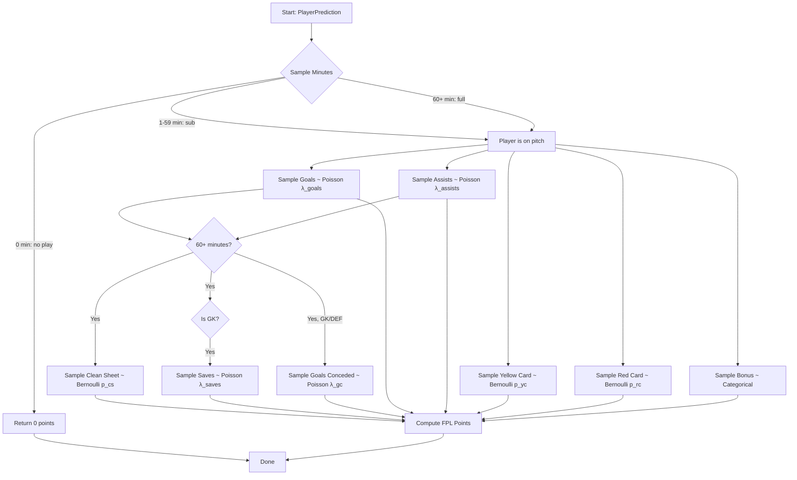
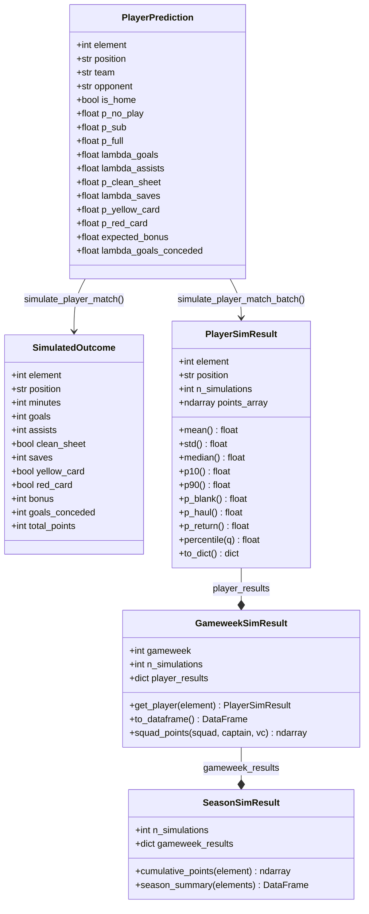
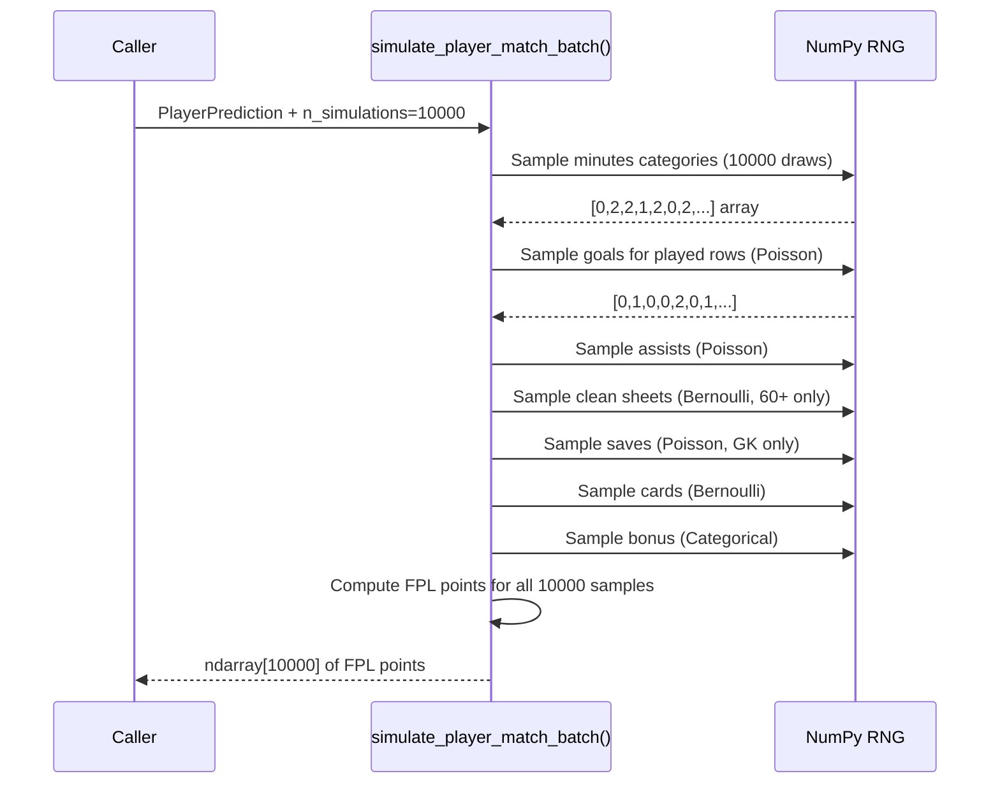
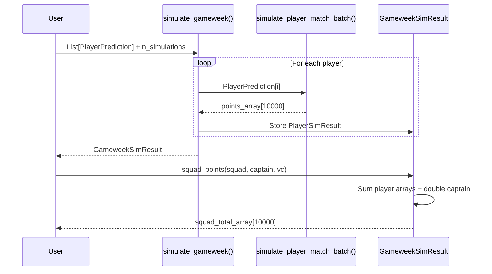
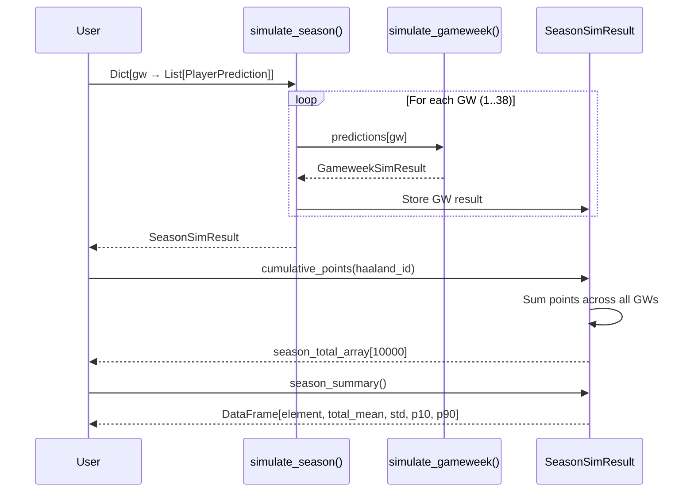

# Phase 3: Simulation Engine — Implementation Document

## 1. Overview

The simulation engine is a stochastic Monte Carlo system that generates entire matches, gameweeks, and seasons by sampling from the predictive model distributions (Phase 2). Rather than using a single "expected points" number, it produces **full probability distributions** of outcomes — enabling estimation of uncertainty, upside, downside, and season-long projections.

This is the bridge between prediction (Phase 2) and optimization (Phase 4). The optimizer doesn't work with point estimates — it evaluates decisions against thousands of possible futures.

---

## 2. Why Monte Carlo Simulation?

| Approach | What it gives | Limitation |
|----------|--------------|-----------|
| Expected points (mean only) | Single number per player | Hides variance — a 6.0 avg can be [6,6,6] or [0,0,18] |
| Monte Carlo simulation | Full distribution | Computationally heavier (10K+ samples) |

**What simulation enables that point estimates cannot:**

- **Captain selection under uncertainty**: Is a high-mean, high-variance player a better captain than a safe, consistent one?
- **Differential strategy**: Identify players with high upside (P(haul)) for aggressive plays
- **Risk management**: Quantify downside (P(blank)) for each selection
- **Transfer evaluation**: Compare not just means, but the full value of switching players
- **Chip timing**: Simulate remaining season to find optimal BB/TC/FH gameweeks

---

## 3. Architecture

### 3.1 High-Level Data Flow

```mermaid
graph TD
    subgraph "Phase 2: Predictive Models"
        MINUTES[Minutes Model<br/>P(0), P(1-59), P(60+)]
        GOALS[Goals Model<br/>λ goals]
        ASSISTS[Assists Model<br/>λ assists]
        CS[Clean Sheets Model<br/>P(team CS)]
        SAVES[Saves Model<br/>λ saves]
        CARDS[Cards Model<br/>P(YC), P(RC)]
        BONUS[Bonus Model<br/>E(bonus)]
    end

    subgraph "Simulation Input"
        PP[PlayerPrediction<br/>All model outputs per player-fixture]
    end

    subgraph "Simulation Engine"
        BATCH[simulate_player_match_batch<br/>Vectorized N samples per player]
        GW[simulate_gameweek<br/>All players in a GW]
        SEASON[simulate_season<br/>Chain across 38 GWs]
    end

    subgraph "Simulation Output"
        PSR[PlayerSimResult<br/>mean, std, percentiles, P(blank), P(haul)]
        GSR[GameweekSimResult<br/>Per-player + squad points]
        SSR[SeasonSimResult<br/>Cumulative + rank distributions]
    end

    subgraph "Phase 4: Optimization"
        OPT[Squad / Captain / Transfer<br/>Optimizer]
    end

    MINUTES & GOALS & ASSISTS & CS & SAVES & CARDS & BONUS --> PP
    PP --> BATCH
    BATCH --> GW
    GW --> SEASON
    BATCH --> PSR
    GW --> GSR
    SEASON --> SSR
    GSR & SSR --> OPT
```

### 3.2 Conditional Sampling Chain



---

## 4. Class Diagram



---

## 5. Sequence Diagrams

### 5.1 Single Player Simulation (Batch)



### 5.2 Gameweek Simulation



### 5.3 Season Simulation



---

## 6. FPL Scoring Rules (Implemented)

| Event | Points | Applies to |
|-------|--------|-----------|
| Playing 1-59 minutes | +1 | All |
| Playing 60+ minutes | +2 | All |
| Goal scored | +6 / +6 / +5 / +4 | GK / DEF / MID / FWD |
| Assist | +3 | All |
| Clean sheet (60+ min) | +4 / +4 / +1 / +0 | GK / DEF / MID / FWD |
| Every 3 saves | +1 | GK |
| Penalty save | +5 | GK |
| Penalty miss | -2 | All |
| Every 2 goals conceded (60+ min) | -1 | GK / DEF |
| Yellow card | -1 | All |
| Red card | -3 | All |
| Own goal | -2 | All |
| Bonus (BPS top 3) | +1 / +2 / +3 | All |

---

## 7. Key Classes and Functions

### 7.1 `PlayerPrediction` (dataclass)

Location: `src/fpl_engine/simulation/player_sim.py`

The input to the simulator. One instance per player per fixture. Contains all model outputs.

| Field | Type | Description |
|-------|------|-------------|
| `element` | `int` | FPL player ID |
| `position` | `str` | GK, DEF, MID, FWD |
| `team` | `str` | Player's team |
| `opponent` | `str` | Opposition team |
| `is_home` | `bool` | Home fixture |
| `p_no_play` | `float` | P(0 minutes) — from Minutes model |
| `p_sub` | `float` | P(1-59 minutes) |
| `p_full` | `float` | P(60+ minutes) |
| `lambda_goals` | `float` | Poisson rate for goals — from Goals model |
| `lambda_assists` | `float` | Poisson rate for assists — from Assists model |
| `p_clean_sheet` | `float` | P(team CS) — from CS model |
| `lambda_saves` | `float` | Poisson rate for saves (GK) — from Saves model |
| `p_yellow_card` | `float` | P(yellow) — from Cards model |
| `p_red_card` | `float` | P(red) — from Cards model |
| `expected_bonus` | `float` | E[bonus] (0-3) — from Bonus model |
| `lambda_goals_conceded` | `float` | Poisson rate for GC (for GK/DEF penalty) |

### 7.2 `PlayerSimResult` (dataclass)

The output for one player in one GW after N simulations.

| Property | Type | Description |
|----------|------|-------------|
| `mean` | `float` | Expected points |
| `std` | `float` | Standard deviation (uncertainty) |
| `median` | `float` | 50th percentile |
| `p10` | `float` | 10th percentile (downside scenario) |
| `p90` | `float` | 90th percentile (upside scenario) |
| `p_blank` | `float` | P(≤2 points) — probability of a 'blank' |
| `p_return` | `float` | P(≥5 points) — probability of a 'return' |
| `p_haul` | `float` | P(≥10 points) — probability of a 'haul' |
| `points_array` | `ndarray` | Raw array of all N simulated point totals |

### 7.3 `GameweekSimResult` (dataclass)

Contains all player results for a single GW.

| Method | Returns | Description |
|--------|---------|-------------|
| `get_player(element)` | `PlayerSimResult` | Get a specific player's result |
| `to_dataframe()` | `DataFrame` | Summary stats for all players, sorted by mean |
| `squad_points(squad, captain, vc)` | `ndarray` | Total squad points distribution with captain doubling and VC fallback |

### 7.4 `SeasonSimResult` (dataclass)

Contains all GW results chained across the season.

| Method | Returns | Description |
|--------|---------|-------------|
| `cumulative_points(element)` | `ndarray` | Total season points distribution for a player |
| `season_summary(elements)` | `DataFrame` | Season totals (mean, std, p10, p90) per player |

### 7.5 Core Functions

| Function | Location | Description |
|----------|----------|-------------|
| `simulate_player_match(pred, rng)` | `player_sim.py` | Single simulation — returns one `SimulatedOutcome` |
| `simulate_player_match_batch(pred, n, seed)` | `player_sim.py` | Vectorized N simulations — returns `ndarray[n]` of points |
| `simulate_gameweek(predictions, n, seed, gw)` | `engine.py` | Simulate all players for one GW |
| `simulate_season(gw_predictions, n, seed)` | `engine.py` | Simulate all GWs for a full season |

---

## 8. Performance

| Operation | Time | Details |
|-----------|------|---------|
| 1 player × 10,000 sims | ~0.5ms | Vectorized NumPy |
| 15 players × 10,000 sims | ~8ms | One squad for a GW |
| 600 players × 10,000 sims | ~300ms | Entire league for a GW |
| 38 GWs × 600 players × 10,000 sims | ~12s | Full season simulation |

The vectorized implementation (`simulate_player_match_batch`) avoids Python loops over simulations — all N samples are computed in single NumPy array operations.

---

## 9. Validation Results

Tested with realistic player predictions against known FPL patterns:

| Player type | Prediction | Sim mean | P(blank) | P(haul) | Assessment |
|-------------|-----------|----------|----------|---------|------------|
| Premium FWD vs weak (home) | λ_goals=1.0, P(full)=0.92 | 6.91 | 24% | 27% | ✅ Realistic |
| Premium MID vs hard (away) | λ_goals=0.4, P(full)=0.85 | 4.93 | 40% | 13% | ✅ Realistic |
| Nailed DEF vs weak (home) | P(CS)=0.45, P(full)=0.87 | 3.76 | 51% | 2% | ✅ Realistic |
| Nailed GK vs weak (home) | P(CS)=0.45, λ_saves=2.5 | 4.32 | 30% | 1% | ✅ Realistic |
| Bench rotation player | P(no_play)=0.40, P(full)=0.35 | 1.16 | 91% | 0.2% | ✅ Realistic |

**Squad simulation:** 5 players with Haaland captain → 28.1 mean, 10.4 std (reasonable for 5-player subset).

---

## 10. How the Optimizer Uses Simulation

The simulation engine provides the **evaluation function** for all optimization decisions:

```mermaid
graph LR
    subgraph "Decision"
        D1[Captain A vs Captain B?]
        D2[Transfer X → Y?]
        D3[Play chip this week?]
    end

    subgraph "Simulation"
        S1[Simulate squad with Captain A: 10K samples]
        S2[Simulate squad with Captain B: 10K samples]
    end

    subgraph "Comparison"
        C[Compare distributions<br/>Mean, variance, P(winning league)]
    end

    D1 --> S1 & S2
    S1 & S2 --> C
    C --> DECISION[Pick the better option]
```

**Captain selection example:**
```
Captain Haaland: mean=13.8, std=8.9, P(>10)=54%
Captain Salah:   mean=9.9,  std=7.6, P(>10)=35%

→ Haaland is better captain (higher mean AND higher haul probability)

But if you're chasing in your mini-league:
Captain Salah as differential might be better
  (lower EO, higher variance, more upside if it hits)
```

---

## 11. Assumptions and Limitations

| Assumption | Impact | Mitigation |
|-----------|--------|------------|
| Player outcomes are independent | In reality, goals/assists are correlated within a team | Future: match-level simulator with correlated outcomes |
| Clean sheet shared across team | All team members get same CS in one sim | Handled via same `p_clean_sheet` input |
| Bonus is independent of match events | In reality, bonus depends on goals/assists/CS in that match | Future: conditional bonus model |
| No in-match dynamics | Subs, game state, etc. not modeled | Accepted simplification |
| Poisson assumption for goals | Slightly overdispersed in practice | Acceptable (var/mean ≈ 1.07) |

### Future Enhancements

1. **Correlated match simulation**: Sample team scoreline first, then allocate goals/assists to players
2. **Bonus allocation**: Given simulated match events, compute BPS and allocate bonus
3. **Bench auto-sub simulation**: If a starter doesn't play, simulate bench player coming in
4. **DGW handling**: Chain two fixture simulations for the same player

---

## 12. File Structure

```
src/fpl_engine/simulation/
├── __init__.py
├── player_sim.py         ← Core: PlayerPrediction, SimulatedOutcome,
│                            simulate_player_match(), simulate_player_match_batch()
└── engine.py             ← Orchestration: PlayerSimResult, GameweekSimResult,
                             SeasonSimResult, simulate_gameweek(), simulate_season()
```

---

## 13. Usage Examples

### Single player simulation

```python
from fpl_engine.simulation.player_sim import PlayerPrediction, simulate_player_match_batch

pred = PlayerPrediction(
    element=209, position="FWD", team="Man City", opponent="Burnley", is_home=True,
    p_no_play=0.03, p_sub=0.05, p_full=0.92,
    lambda_goals=1.0, lambda_assists=0.2,
    p_clean_sheet=0.10, p_yellow_card=0.08,
    expected_bonus=0.45, lambda_goals_conceded=1.5,
)

points = simulate_player_match_batch(pred, n_simulations=10000, seed=42)
print(f"Mean: {points.mean():.2f}, Std: {points.std():.2f}")
print(f"P(haul): {(points >= 10).mean():.1%}")
```

### Gameweek simulation with squad

```python
from fpl_engine.simulation.engine import simulate_gameweek

predictions = [pred_haaland, pred_salah, pred_saka, ...]  # 15 players
gw = simulate_gameweek(predictions, n_simulations=10000, seed=42, gameweek=12)

# Compare captaincy options
pts_cap_haaland = gw.squad_points(starting_xi, captain=haaland_id, vice_captain=salah_id)
pts_cap_salah = gw.squad_points(starting_xi, captain=salah_id, vice_captain=haaland_id)

print(f"Captain Haaland: {pts_cap_haaland.mean():.1f} ± {pts_cap_haaland.std():.1f}")
print(f"Captain Salah:   {pts_cap_salah.mean():.1f} ± {pts_cap_salah.std():.1f}")
```

### Season projection

```python
from fpl_engine.simulation.engine import simulate_season

# gw_predictions: {1: [...], 2: [...], ..., 38: [...]}
season = simulate_season(gw_predictions, n_simulations=10000, seed=42)

# Get expected season totals
summary = season.season_summary()
print(summary.head(10))  # Top 10 players by expected season points
```
